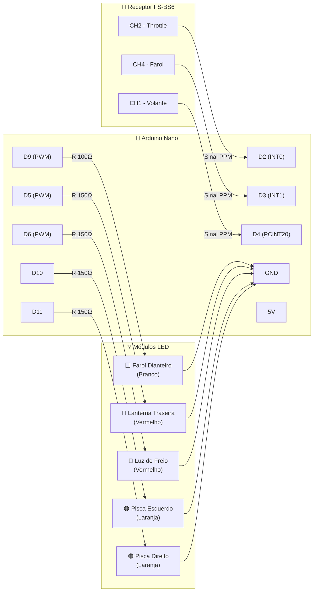

# Esquema de Ligação — Sistema de Luzes RC / Wiring Diagram

[**Português**](#português) | [**English**](#english)

---

## Português

Este documento detalha o mapeamento de pinos, conexões de sinal com o receptor e a pinagem dos LEDs com seus respectivos resistores limitadores.

### 🔌 Diagrama Geral de Ligação



### 📍 Mapeamento Pino-a-Pino

```
                          ┌────────────────┐
                          │  ARDUINO NANO  │
                          │                │
    Receptor CH2 SIG ────→│ D2         D13 │
    Receptor CH4 SIG ────→│ D3         D12 │
    Receptor CH1 SIG ────→│ D4         D11 │←── [R 150Ω] ──→ LED Pisca DIR (Laranja) ──→ GND
                          │ D5  ───────────┼───→ [R 150Ω] ──→ LED Lanterna Traseira (Vermelho) ──→ GND
                          │ D6  ───────────┼───→ [R 150Ω] ──→ LED Luz de Freio (Vermelho) ──→ GND
                          │ D7         D10 │←── [R 150Ω] ──→ LED Pisca ESQ (Laranja) ──→ GND
                          │             D9 │←── [R 100Ω] ──→ LED Farol Dianteiro (Branco) ──→ GND
                          │                │
                          │ GND         5V │
                          └──┬───────────┬─┘
                             │           │
            ┌────────────────┘           └───── (Opcional - Ver Alimentação abaixo)
            ▼
      GND do Receptor
            +
      GND dos LEDs (Catodos -)
```

### 📦 Lista de Componentes e Dimensionamento dos Resistores

A fórmula utilizada para calcular os resistores é a Lei de Ohm adaptada para LEDs:
$$\text{R} = \frac{5\text{V} - V_{led}}{I_{led}}$$
*Onde: $I_{led} = 20\text{mA} = 0.02\text{A}$.*

| LED | Cor | Queda de Tensão ($V_{led}$) | R Calculado | R Recomendado (Comercial) |
|---|:---:|:---:|:---:|:---:|
| **Farol** (Pino D9) | Branco | $3.2\text{V}$ | $90\Omega$ | **$100\Omega$** |
| **Lanterna** (Pino D5) | Vermelho | $2.0\text{V}$ | $150\Omega$ | **$150\Omega$** |
| **Freio** (Pino D6) | Vermelho | $2.0\text{V}$ | $150\Omega$ | **$150\Omega$** |
| **Piscas** (Pinos D10/D11)| Laranja | $2.1\text{V}$ | $145\Omega$ | **$150\Omega$** |

> [!IMPORTANT]
> **Ajuste e Teste de Brilho pelo Usuário:**
> Os valores calculados na tabela ($100\Omega$ e $150\Omega$) são referências teóricas de segurança para manter a corrente próxima ao limite padrão de $20\text{mA}$. 
> **Recomenda-se realizar testes práticos antes da montagem final:**
> - **Se a luz estiver muito forte (inadequada):** Troque por resistores de **maior valor** (como $220\Omega$, $330\Omega$ ou $470\Omega$). Isso também ajuda a economizar bateria.
> - **Se a luz estiver muito fraca (inadequada):** Troque por resistores de **menor valor** para aumentar a intensidade. *Cuidado:* Não reduza excessivamente o resistor para não queimar o LED e não sobrecarregar o pino do Arduino. Recomenda-se manter o limite mínimo absoluto em $82\Omega$ para o farol branco e $120\Omega$ para os LEDs vermelhos e laranjas.

### 🔋 Recomendações de Alimentação

1. **Se o Receptor já é alimentado pelo ESC:**
   - Conecte apenas os **fios de sinal (branco/amarelo)** e os **fios de terra (GND - preto/marrom)** entre o receptor e o Arduino.
   - **NÃO** conecte o pino de 5V do Arduino ao VCC (pino central vermelho) do receptor.
2. **GND Comum (Crucial):**
   - O pino GND do Arduino Nano, o pino GND do receptor de rádio e o cátodo (perna negativa) de todos os LEDs **devem estar eletricamente interligados**. Sem a referência comum de terra (GND), o sinal PPM sofrerá flutuações e as luzes piscarão erraticamente.

---

## English

This document outlines the pin mapping, signal connections with the receiver, and LED wiring with their respective current-limiting resistors.

### 🔌 General Connection Diagram

Refer to the Mermaid diagram in the [Português](#português) section. Signals are connected as follows:
- **CH1 (Steering signal)** ──→ Arduino Pin **D4**
- **CH2 (Throttle signal)** ──→ Arduino Pin **D2** (External Interrupt INT0)
- **CH4 (Headlight signal)** ──→ Arduino Pin **D3** (External Interrupt INT1)

### 📍 Pin-to-Pin Layout

Refer to the ASCII drawing in the [Português](#português) section. Keep in mind:
- **D9** controls the white Headlight.
- **D5** controls the red Tail light.
- **D6** controls the red Brake light.
- **D10** and **D11** control the orange Left/Right Blinkers respectively.

### 📦 Component List & Resistor Sizing

The resistor formula used is Ohm's Law adapted for LEDs:
$$\text{R} = \frac{5\text{V} - V_{led}}{I_{led}}$$
*Where $I_{led} = 20\text{mA} = 0.02\text{A}$.*

| LED | Color | Voltage Drop ($V_{led}$) | R Calculated | Recommended R (Commercial) |
|---|:---:|:---:|:---:|:---:|
| **Headlight** (Pin D9) | White | $3.2\text{V}$ | $90\Omega$ | **$100\Omega$** |
| **Tail Light** (Pin D5)| Red | $2.0\text{V}$ | $150\Omega$ | **$150\Omega$** |
| **Brake Light** (Pin D6)| Red | $2.0\text{V}$ | $150\Omega$ | **$150\Omega$** |
| **Blinkers** (Pins D10/D11)| Orange | $2.1\text{V}$ | $145\Omega$ | **$150\Omega$** |

> [!IMPORTANT]
> **Brightness Adjusting & Testing by the User:**
> The calculated resistor values ($100\Omega$ and $150\Omega$) are theoretical safety guidelines to keep current near the standard $20\text{mA}$ limit.
> **We strongly recommend running test bench experiments before final assembly:**
> - **If the light is too bright (inadequate):** Swap for **higher value** resistors (such as $220\Omega$, $330\Omega$, or $470\Omega$). This also saves battery power.
> - **If the light is too dim (inadequate):** Swap for **lower value** resistors to increase intensity. *Caution:* Do not reduce the resistance too much as it might burn out the LED or overload the Arduino pins. Keep the absolute minimum resistance at $82\Omega$ for the white headlight and $120\Omega$ for red and orange LEDs.

### 🔋 Powering Recommendations

1. **If the Receiver is already powered by the ESC:**
   - Only connect the **signal wires (white/yellow)** and **ground wires (GND - black/brown)** between the receiver and the Arduino.
   - **DO NOT** connect the Arduino's 5V pin to the receiver's VCC (red middle pin) to prevent power supply conflicts.
2. **Common Ground (Crucial):**
   - The GND pin of the Arduino Nano, the GND pin of the receiver, and the cathode (negative pin) of all LEDs **must be connected to a common ground**. Without a common ground, PPM signals will fluctuate and cause the LEDs to flicker.
