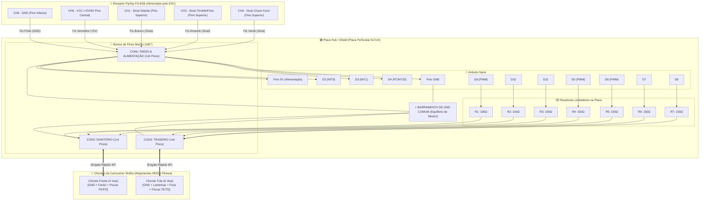

# Esquema de Ligação — Sistema de Luzes RC v2.0

[🇧🇷 **Versão em Português**](#-português) | [🇺🇸 **English Version (WIRING_SCHEMATIC.md)**](WIRING_SCHEMATIC.md)

---

## Português

Este documento detalha o mapeamento de pinos, o design da **Placa Shield Hub (em placa perfurada 5x7cm)** com os conectores do **Conjunto 1 (Linha MODU / Dupont 2.54mm)**, a alimentação do Arduino via **Canal 6 (CH6)** do receptor e o barramento de **GND Comum (Equilíbrio de Neutro)**.

---

### 🔌 1. Diagrama Geral de Blocos do Sistema


```mermaid
flowchart TD
    subgraph RECEPTOR["📡 Receptor FlySky FS-BS6 (Alimentado pelo ESC)"]
        RX_CH6_VCC["CH6 - VCC (+5V/6V Pino Central)"]
        RX_CH6_GND["CH6 - GND (Pino Inferior)"]
        RX_CH1["CH1 - Sinal Volante (Pino Superior)"]
        RX_CH2["CH2 - Sinal Throttle/Freio (Pino Superior)"]
        RX_CH4["CH4 - Sinal Chave Farol (Pino Superior)"]
    end

    subgraph SHIELD["🟢 Placa Hub / Shield (Placa Perfurada 5x7cm)"]
        direction TB
        GND_BUS["⚡ BARRAMENTO DE GND COMUM (Equilíbrio de Neutro)"]
        
        subgraph ARDUINO["🔵 Arduino Nano"]
            NANO_5V["Pino 5V (Alimentação)"]
            D2["D2 (INT0)"]
            D3["D3 (INT1)"]
            D4["D4 (PCINT20)"]
            D5["D5 (PWM)"]
            D6["D6 (PWM)"]
            D7["D7"]
            D8["D8"]
            D9["D9 (PWM)"]
            D10["D10"]
            D11["D11"]
            NANO_GND["Pino GND"]
        end

        subgraph RESISTORES["📦 Resistores Limitadores na Placa"]
            R_FAROL["R1: 100Ω"]
            R_PISCA_FE["R2: 150Ω"]
            R_PISCA_FD["R3: 150Ω"]
            R_LANTERNA["R4: 150Ω"]
            R_FREIO["R5: 150Ω"]
            R_PISCA_TE["R6: 150Ω"]
            R_PISCA_TD["R7: 150Ω"]
        end

        subgraph CONECTORES_PLACA["🔌 Barras de Pinos Macho (180°)"]
            CON_RADIO["CON1: RÁDIO & ALIMENTAÇÃO (1x5 Pinos)"]
            CON_FRENTE["CON2: DIANTEIRO (1x4 Pinos)"]
            CON_TRAS["CON3: TRASEIRO (1x6 Pinos)"]
        end
    end

    subgraph CHICOTES["🚗 Chicotes da Carroceria / Bolha (Alojamentos MODU Fêmea)"]
        CHICOTE_DIANT["Chicote Frente (4 Vias)\n[GND + Faróis + Piscas FE/FD]"]
        CHICOTE_TRAS["Chicote Trás (6 Vias)\n[GND + Lanternas + Freio + Piscas TE/TD]"]
    end

    %% Alimentação e Sinais vindos do Receptor
    RX_CH6_GND -->|"Fio Preto (GND)"| CON_RADIO
    RX_CH6_VCC -->|"Fio Vermelho (+5V)"| CON_RADIO
    RX_CH1     -->|"Fio Branco (Sinal)"| CON_RADIO
    RX_CH2     -->|"Fio Amarelo (Sinal)"| CON_RADIO
    RX_CH4     -->|"Fio Verde (Sinal)"| CON_RADIO

    %% Roteamento interno do CON1
    CON_RADIO --> NANO_5V
    CON_RADIO --> NANO_GND
    CON_RADIO --> D4
    CON_RADIO --> D2
    CON_RADIO --> D3

    %% GND Comum
    NANO_GND --- GND_BUS
    GND_BUS --- CON_RADIO
    GND_BUS --- CON_FRENTE
    GND_BUS --- CON_TRAS

    %% Saídas para Resistores
    D9  --> R_FAROL      --> CON_FRENTE
    D10 --> R_PISCA_FE   --> CON_FRENTE
    D11 --> R_PISCA_FD   --> CON_FRENTE

    D5  --> R_LANTERNA   --> CON_TRAS
    D6  --> R_FREIO      --> CON_TRAS
    D7  --> R_PISCA_TE   --> CON_TRAS
    D8  --> R_PISCA_TD   --> CON_TRAS

    %% Saídas para Bolha
    CON_FRENTE <==|Engate Rápido 4P|==> CHICOTE_DIANT
    CON_TRAS   <==|Engate Rápido 6P|==> CHICOTE_TRAS
```

---

### 🗺️ 2. Layout Físico da Placa Hub / Shield (Placa Perfurada 5x7cm)

```
┌────────────────────────────────────────────────────────────────────────┐
│               PLACA HUB SHIELD DE ILUMINAÇÃO (5x7 cm)                  │
│                                                                        │
│   ┌──────────────────────── Arduino Nano ────────────────────────┐     │
│   │ [D13] [3V3] [REF] [A0] [A1] [A2] [A3] [A4] [A5] [A6] [A7] [5V] │    │
│   │                                                             ▲│     │
│   │ [D12] [D11] [D10] [D9] [D8] [D7] [D6] [D5] [D4] [D3] [D2] [GND]│   │
│   └───┬─────┬─────┬────┬────┬────┬────┬────┬────┬────┬────┬────┬───┘    │
│       │     │     │    │    │    │    │    │    │    │    │    │        │
│       │     │     │    │    │    │    │    │    │    │    │    └────┐   │
│       │     │     │    │    │    │    │    │    │    │    └─┐       │   │
│       │     │     │    │    │    │    │    │    │    └──┐  │       │   │
│       │     │     │    │    │    │    │    │    └─┐    │  │       │   │
│       │     │     │    │    │    │    │    │      │    │  │       ▼   │
│       │     │     │    │    │    │    │    │   ┌──┴────┴──┴────────────┐
│       │     │     │    │    │    │    │    │   │ CON1: RÁDIO (1x5)     │
│       │     │     │    │    │    │    │    │   │ [1] GND (Preto CH6)   │
│       │     │     │    │    │    │    │    │   │ [2] +5V (Vermelho CH6)┼───┐ (Alimenta o
│       │     │     │    │    │    │    │    │   │ [3] CH1 (D4 Volante)  │   │  pino 5V do
│       │     │     │    │    │    │    │    │   │ [4] CH2 (D2 Throttle) │   │  Arduino)
│       │     │     │    │    │    │    │    │   │ [5] CH4 (D3 Farol)    │   │
│       │     │     │    │    │    │    │    │   └───────────────────────┘   │
│       │     │     │    │    │    │    │    │                               │
│       │  [R3 150Ω]│    │ [R7 150Ω]│  [R5 150Ω] ◄───────────────────────────┘
│       │     │     │    │    │    │    │    │                          │
│       │  [R2 150Ω]│    │ [R6 150Ω]│  [R4 150Ω]                          │
│       │     │     │    │    │    │    │    │                          │
│       │     │  [R1 100Ω]    │    │    │    │                          │
│       │     │     │    │    │    │    │    │                          │
│       ▼     ▼     ▼    │    ▼    ▼    ▼    ▼                          │
│   ┌────────────────┐   │  ┌─────────────────────────┐                 │
│   │CON2: FRENTE 1x4│   │  │    CON3: TRÁS 1x6       │                 │
│   │ [1] GND Comum ─┼───┴──┼─► [1] GND Comum         │                 │
│   │ [2] Farol (D9) │      │   [2] Lanterna (D5)     │                 │
│   │ [3] Pisca FE   │      │   [3] Freio (D6)        │                 │
│   │ [4] Pisca FD   │      │   [4] Pisca TE (D7)     │                 │
│   └────────────────┘      │   [5] Pisca TD (D8)     │                 │
│                           │   [6] Reserva / Guia    │                 │
│                           └─────────────────────────┘                 │
│                                                                        │
│   ══════════════════════════════════════════════════════════════════   │
│   ⚡ BARRAMENTO GND COMUM (Trilha de solda contínua no verso da placa)  │
└────────────────────────────────────────────────────────────────────────┘
```

---

### 📍 3. Pinagem dos Conectores (Conjunto 1 - Linha MODU)

#### 📡 CON1: Conector do Receptor de Rádio e Alimentação (1x5 Pinos Macho)
*Conecta o receptor FlySky FS-BS6 ao Shield, alimentando o Arduino pelo CH6 e lendo os sinais dos canais 1, 2 e 4.*

| Pino | Identificação | Ligação no Shield | Ligação no Receptor FS-BS6 | Cor do Fio |
| :---: | :---: | :--- | :--- | :---: |
| **1** | **GND** | Barramento GND Comum | **CH6 — Linha Inferior (Pino GND)** | ⬛ Preto |
| **2** | **VCC (+5V)** | **Pino 5V do Arduino Nano** | **CH6 — Linha Central (Pino VCC +5V/6V)** | 🟥 Vermelho |
| **3** | **CH1 (Sinal)** | Pino D4 do Arduino | **CH1 — Linha Superior (Sinal Volante)** | ⬜ Branco |
| **4** | **CH2 (Sinal)** | Pino D2 do Arduino | **CH2 — Linha Superior (Sinal Throttle)** | 🟨 Amarelo |
| **5** | **CH4 (Sinal)** | Pino D3 do Arduino | **CH4 — Linha Superior (Sinal Chave Farol)**| 🟩 Verde |

> [!TIP]
> **Consumo de Corrente do Sistema:**
> O conjunto Arduino Nano + todos os LEDs acesos simultaneamente consome cerca de **180mA a 220mA**. Os circuitos BEC dos ESCs modernos fornecem entre **2A e 3A** na linha de 5V do receptor, suportando o sistema com ampla folga de segurança.

---

#### 💡 CON2: Conector do Chicote Dianteiro (1x4 Pinos Macho)

| Pino | Função | Componente na Placa | Destino na Bolha | Cor do Fio |
| :---: | :--- | :--- | :--- | :---: |
| **1** | **GND** | Barramento GND | Negativo comum de todos os LEDs da frente | ⬛ Preto |
| **2** | **Farol Dianteiro** | Pino D9 $\rightarrow$ Resistor R1 ($100\Omega$) | Ânodo (+) dos LEDs Brancos de Farol | ⬜ Branco |
| **3** | **Pisca Diant. Esq.** | Pino D10 $\rightarrow$ Resistor R2 ($150\Omega$) | Ânodo (+) do LED Laranja Esquerdo | 🟧 Laranja |
| **4** | **Pisca Diant. Dir.** | Pino D11 $\rightarrow$ Resistor R3 ($150\Omega$) | Ânodo (+) do LED Laranja Direito | 🟦 Azul |

---

#### 💡 CON3: Conector do Chicote Traseiro (1x6 Pinos Macho)

| Pino | Função | Componente na Placa | Destino na Bolha | Cor do Fio |
| :---: | :--- | :--- | :--- | :---: |
| **1** | **GND** | Barramento GND | Negativo comum dos LEDs traseiros | ⬛ Preto |
| **2** | **Lanternas** | Pino D5 $\rightarrow$ Resistor R4 ($150\Omega$) | Ânodo (+) das Lanternas Vermelhas | 🟫 Marrom |
| **3** | **Luz de Freio** | Pino D6 $\rightarrow$ Resistor R5 ($150\Omega$) | Ânodo (+) dos LEDs de Freio Vermelhos | 🟥 Vermelho |
| **4** | **Pisca Tras. Esq.** | Pino D7 $\rightarrow$ Resistor R6 ($150\Omega$) | Ânodo (+) do LED Laranja Traseiro Esq. | 🟧 Laranja |
| **5** | **Pisca Tras. Dir.** | Pino D8 $\rightarrow$ Resistor R7 ($150\Omega$) | Ânodo (+) do LED Laranja Traseiro Dir. | 🟦 Azul |
| **6** | **Reserva / Guia** | Desconectado (NC) | Pino cego / Guia mecânica / Expansão | ⚪ Cinza / Livre |

---

### 📦 4. Dimensionamento de Resistores (Todos na Placa)

| Resistor | Canal | LEDs Conectados | Valor | Potência |
| :---: | :---: | :--- | :---: | :---: |
| **R1** | D9 | 2x LEDs Farol Branco | **$100\Omega$** (ou $82\Omega$) | 1/4W |
| **R2** | D10 | 1x LED Pisca Diant. Esquerdo | **$150\Omega$** | 1/4W |
| **R3** | D11 | 1x LED Pisca Diant. Direito | **$150\Omega$** | 1/4W |
| **R4** | D5 | 2x LEDs Lanterna Vermelha | **$150\Omega$** (ou $100\Omega$) | 1/4W |
| **R5** | D6 | 2x LEDs Luz de Freio Vermelha | **$150\Omega$** (ou $100\Omega$) | 1/4W |
| **R6** | D7 | 1x LED Pisca Tras. Esquerdo | **$150\Omega$** | 1/4W |
| **R7** | D8 | 1x LED Pisca Tras. Direito | **$150\Omega$** | 1/4W |

---

## English

This document provides the full pinout and physical shield board design (5x7cm perfboard) utilizing **Set 1 (MODU / Dupont 2.54mm)** connectors. The Arduino is directly powered through **Channel 6 (CH6)** of the FlySky FS-BS6 receiver (VCC + GND), featuring full common ground reference and quick-disconnect harness connectors.
