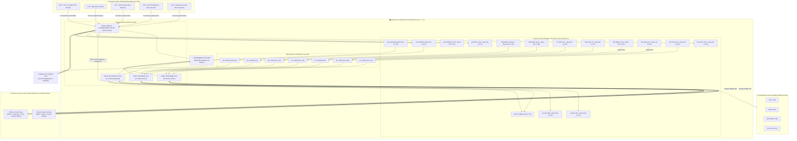

# Esquema de Ligação — Sistema de Luzes RC v7.2

[🇧🇷 **Versão em Português**](#-português) | [🇺🇸 **English Version (WIRING_SCHEMATIC.md)**](WIRING_SCHEMATIC.md)

---

## Português

Este documento detalha o mapeamento de pinos, o design da **Placa Shield Hub (em placa perfurada 5x7cm)** com os conectores do **Conjunto 1 (Linha MODU / Dupont 2.54mm em 90°)**, a interface I2C com o acelerômetro **MPU-6050 (GY-521)** nos pinos **A4/A5**, a alimentação via **Canal 6 (CH6)** do receptor e o barramento de **GND Mestre Unificado (Equilíbrio de Neutro)**.

---

### 🔌 1. Diagrama Geral de Blocos do Sistema


```mermaid
flowchart TD
    subgraph RECEPTOR["📡 Receptor FlySky FS-BS6 (Alimentado pelo ESC)"]
        RX_CH6_VCC["CH6 - VCC (+5V BEC Pino Central)"]
        RX_CH6_GND["CH6 - GND (Pino Inferior)"]
        RX_CH1["CH1 - Sinal Volante (Pino Superior)"]
        RX_CH2["CH2 - Sinal Throttle/Freio (Pino Superior)"]
        RX_CH4["CH4 - Sinal Chave Farol (Pino Superior)"]
    end

    subgraph MPU["🧭 Acelerômetro Inercial 3D MPU-6050 (GY-521)"]
        MPU_VCC["VCC (+5V)"]
        MPU_GND["GND (Terra)"]
        MPU_SDA["SDA (Dados I2C)"]
        MPU_SCL["SCL (Clock I2C)"]
    end

    subgraph SHIELD["🟢 Placa Hub / Shield (Placa Perfurada 5x7cm) — v7.2"]
        direction TB
        GND_BUS["⚡ BARRAMENTO DE GND MESTRE (Equilíbrio de Neutro)"]
        
        subgraph ARDUINO["🔵 Arduino Nano (Pinagem Física Real: docs.arduino.cc)"]
            NANO_5V["Pino 5V (Barra Esq Lin 14)"]
            A4["A4 (I2C SDA - Barra Esq Lin 10)"]
            A5["A5 (I2C SCL - Barra Esq Lin 11)"]
            NANO_GND_L["Pino GND Esq (Barra Esq Lin 16)"]
            D2["D2 (INT0 / CH2 - Barra Dir Lin 13)"]
            D3["D3 (INT1 / CH4 - Barra Dir Lin 12)"]
            D4["D4 (PCINT20 / CH1 - Barra Dir Lin 11)"]
            D5["D5 (PWM / Lanterna - Barra Dir Lin 10)"]
            D6["D6 (PWM / Freio - Barra Dir Lin 09)"]
            D7["D7 (Pisca TE - Barra Dir Lin 08)"]
            D8["D8 (Pisca TD - Barra Dir Lin 07)"]
            D9["D9 (PWM / Farol - Barra Dir Lin 06)"]
            D10["D10 (Pisca FE - Barra Dir Lin 05)"]
            D11["D11 (Pisca FD - Barra Dir Lin 04)"]
            NANO_GND_R["Pino GND Dir (Barra Dir Lin 14)"]
        end

        subgraph RESISTORES["📦 Resistores Limitadores na Placa"]
            R_FAROL["R1: 100Ω (Faróis)"]
            R_PISCA_FE["R2: 150Ω (Pisca FE)"]
            R_PISCA_FD["R3: 150Ω (Pisca FD)"]
            R_PISCA_TD["R7: 150Ω (Pisca TD)"]
            R_PISCA_TE["R6: 150Ω (Pisca TE)"]
            R_FREIO["R5: 150Ω (Freio)"]
            R_LANTERNA["R4: 150Ω (Lanternas)"]
        end

        subgraph CONECTORES_PLACA["🔌 Barras de Pinos Macho em 90°"]
            CON_RADIO["CON1: RÁDIO & ALIMENTAÇÃO (1x5 90° Lateral Direita)"]
            CON_FRENTE["CON2: DIANTEIRO (1x4 90° Borda Inferior)"]
            CON_TRAS["CON3: TRASEIRO (1x6 90° Borda Inferior)"]
            CON_MPU["CON4: MPU-6050 I2C (1x4 90° Lateral Esquerda)"]
        end
    end

    subgraph CHICOTES["🚗 Chicotes da Carroceria / Bolha (Alojamentos MODU Fêmea)"]
        CHICOTE_DIANT["Chicote Frente (4 Vias)\n[GND + Faróis + Piscas FE/FD]"]
        CHICOTE_TRAS["Chicote Trás (6 Vias)\n[GND + Lanternas + Freio + Piscas TE/TD]"]
    end

    %% Alimentação e Sinais vindos do Receptor
    RX_CH6_GND -->|"Fio Preto (GND Mestre)"| CON_RADIO
    RX_CH6_VCC -->|"Fio Vermelho (+5V BEC)"| CON_RADIO
    RX_CH1     -->|"Fio Branco (Sinal CH1)"| CON_RADIO
    RX_CH4     -->|"Fio Verde (Sinal CH4)"| CON_RADIO
    RX_CH2     -->|"Fio Amarelo (Sinal CH2)"| CON_RADIO

    %% Filtragem Imediata na Entrada (Premissa #2)
    CON_RADIO === C1_FILTER["🔋 Capacitor C1 (100µF x 16V)\n[Col 15, Regulação na Entrada]"]

    %% Roteamento interno do CON1 (10mm diretos na lateral direita)
    CON_RADIO --> NANO_GND_R
    CON_RADIO --> D4
    CON_RADIO --> D3
    CON_RADIO --> D2
    CON_RADIO -->|"Trilha +5V Perimetral + Jumper W1"| NANO_5V

    %% Conexões MPU-6050 (10mm diretos na lateral esquerda)
    CON_MPU <--> MPU
    CON_MPU --> NANO_5V
    CON_MPU --> GND_BUS
    CON_MPU --> A4
    CON_MPU --> A5

    %% GND Comum Unificado (Premissa #3)
    NANO_GND_R --- GND_BUS
    NANO_GND_L --- GND_BUS
    GND_BUS --- CON_RADIO
    GND_BUS --- C1_FILTER
    GND_BUS --- CON_FRENTE
    GND_BUS --- CON_TRAS
    GND_BUS --- CON_MPU

    %% Saídas para Resistores
    D9  -->|"Jumper W2"| R_FAROL      --> CON_FRENTE
    D10 -->|"Jumper W3"| R_PISCA_FE   --> CON_FRENTE
    D11 --> R_PISCA_FD   --> CON_FRENTE

    D5  --> R_LANTERNA   --> CON_TRAS
    D6  --> R_FREIO      --> CON_TRAS
    D7  --> R_PISCA_TE   --> CON_TRAS
    D8  --> R_PISCA_TD   --> CON_TRAS

    %% Saídas para Bolha
    CON_FRENTE <==|Engate Rápido 4P|==> CHICOTE_DIANT
    CON_TRAS   <==|Engate Rápido 6P|==> CHICOTE_TRAS
```

---

### 🗺️ 2. Layout Físico da Placa Hub / Shield (Placa Perfurada 5x7cm) — v7.2 Distribuído

```
┌────────────────────────────────────────────────────────────────────────┐
│               PLACA HUB SHIELD DE ILUMINAÇÃO (5x7 cm) - v7.2           │
│                                                                        │
│                      ┌─── [PORTA USB NANO] ───┐                        │
│                      │                        │                        │
│                      │  ARDUINO NANO V3 (DIP) │                        │
│                      │ (Encaixado em 2 barras │                        │
│                      │   fêmeas de 1x15 pinos)│                        │
│                      │                        │                        │
│             (Col 6)  │                        │  (Col 12)              │
│         [D13]  (o)   │                        │   (o)  [D12]           │
│         [3V3]  (o)   │                        │   (o)  [D11/P.FD]══╗   │
│         [REF]  (o)   │                        │   (o)  [D10/P.FE]··╫·┐ │ (Jumper D10)
│         [A0]   (o)   │                        │   (o)  [D9/Farol]··╫─┼┐│ (Jumper D9)
│         [A1]   (o)   │                        │   (o)  [D8/PTD]    ║ │││
│         [A2]   (o)   │                        │   (o)  [D7/PTE]    ║ │││
│         [A3]   (o)   │                        │   (o)  [D6/Freio]  ║ │││
│   ┌─────[A4/SDA](o)  │                        │   (o)  [D5/Lant]   ║ │││
│  ┌┼─────[A5/SCL](o)  │                        │   (o)  [D4/CH1]──┐ ║ │││
│  ││     [A6]   (o)   │                        │   (o)  [D3/CH4]─┐│ ║ │││
│  ││     [A7]   (o)   │                        │   (o)  [D2/CH2]┐││ ║ │││
│  ││ ┌···[5V]   (o)   │                        │   (o)  [GND]───┼┼┼─╫─┼┼┤ [CON1 P2]
│  ││ │ ┌─[GND]  (o)···┼························┼···(o)  (JmpGND)│││ ║ ││││
│  ││ │ │ [VIN]  (o)   │                        │   (o)  [TX]    │││ ║ ││││
│┌─┴┴─┴─┴─────┐        │                        │                │││ ║ ││││
││CON4: MPU   │        │                        │               ┌┴┴┴─┴─┴┴┤
││(1x4 em 90° │        │                        │               │CON1:   │
││Lateral Esq)│        │                        │               │RÁDIO   │
││[4: SDA]◄───┘        │                        │               │(1x5 90°│
││[3: SCL]◄───┘        │                        │      [CH1 :5]◄┼────────┘
││[2: +5V]◄──┐         │                        │      [CH4 :4]◄┼───────┘
││[1: GND]◄──┼┐        └────────────────────────┘      [CH2 :3]◄┼──────┘
│└┬──────────┼┴─────────┐       ║  ║  ║                [GND :2]◄┼─C1(-)
│ ▼ (Pinos 90°          │       ║  ║  ║                [+5V :1]◄┼─C1(+) ➔ Col 18
│ para a esq.)          │       ║  ║  ║                └┬───────┘
│                       │       ║  ║  ║                 ▼ (Pinos 90° dir.)
│                       │       ║  ║  ║
│                 [R1]  ▼ [R2]  ▼[R3] ▼[R7][R6][R5][R4]
│                 100Ω    150Ω   150Ω  150Ω 150Ω 150Ω 150Ω
│                (Farol) (P.FE) (P.FD) (PTD)(PTE)(Fre)(Lan)
│                  │       │      │      │   │   │   │
│                  ▼       ▼      ▼      ▼   ▼   ▼   ▼
│         ┌───────────────────────┐   ┌────────────────────────┐
│         │ CON2: FRENTE (1x4 90°)│   │ CON3: TRÁS (1x6 90°)   │
│         │┌─────┬───────┬──────┬─┴─┐ │┌───┬───┬───┬───┬───┬──┐│
│         ││ GND │ Farol │Pis.FE│P.FD│││PTD│PTE│Fre│Lan│NC │GND│
│         │└──┬──┴───┬───┴──┬───┴───┘ │└─┬─┴─┬─┴─┬─┴─┬─┴─┬─┴─┬┘│
│         └───┼──────┼──────┼─────────┘└──┼───┼───┼───┼───┼───┼──┘
│             │      │      │             │   │   │   │   │   │
│             │      ▼      ▼             ▼   ▼   ▼   ▼   │   │
│             │    (Pinos 90° apontam para fora da borda) │   │
│             │                                               │
│             └══════ (GND via Col 01)   (GND via Col 13) ════╝
└────────────────────────────────────────────────────────────────────────┘
```

---

### 📍 3. Pinagem dos Conectores (Conjunto 1 - Linha MODU 90°)

#### 📡 CON1: Conector do Receptor de Rádio e Alimentação (1x5 Pinos 90° — Lateral Direita)
*Posicionado na **Lateral Direita** (Coluna 17, Linhas 11 a 15), face a face com os pinos D4, D3, D2 e GND do Nano. Trilhas ultracurtas de 10mm!*

| Pino | Identificação | Ligação no Shield | Ligação no Receptor FS-BS6 | Cor do Fio |
| :---: | :---: | :--- | :--- | :---: |
| **1** | **VCC (+5V)** | **C1(+)** (Col 15, Lin 15) $\rightarrow$ Margem Col 18 $\rightarrow$ Topo Lin 01 $\rightarrow$ Margem Col 01 $\rightarrow$ **CON4 P2** (Col 02, Lin 12) e **Jumper W1** para **Nano 5V** (Col 06, Lin 14) | **CH6 — Linha Central (Pino VCC +5V BEC)** | 🟥 Vermelho |
| **2** | **GND** | **C1(-)** (Col 15, Lin 14) $\rightarrow$ **Nano GND Dir** (Col 12, Lin 14) $\rightarrow$ **GND Mestre Unificado** | **CH6 — Linha Inferior (Pino GND)** | ⬛ Preto |
| **3** | **CH2 (Sinal)** | **Nano D2** (Col 12, Lin 13) [10mm] | **CH2 — Linha Superior (Sinal Throttle)** | 🟨 Amarelo |
| **4** | **CH4 (Sinal)** | **Nano D3** (Col 12, Lin 12) [10mm] | **CH4 — Linha Superior (Sinal Chave Farol)**| 🟩 Verde |
| **5** | **CH1 (Sinal)** | **Nano D4** (Col 12, Lin 11) [10mm] | **CH1 — Linha Superior (Sinal Volante)** | ⬜ Branco |

---

#### 🧭 CON4: Conector do Acelerômetro MPU-6050 (1x4 Pinos 90° — Lateral Esquerda)
*Posicionado na **Lateral Esquerda** (Coluna 02, Linhas 10 a 13), face a face com os pinos I2C e alimentação do Nano. Trilhas ultracurtas de 10mm!*

| Pino | Identificação | Ligação no Shield | Ligação no MPU-6050 | Cor do Fio |
| :---: | :---: | :--- | :--- | :---: |
| **1** | **GND** | Trilha esquerda de terra unida a **Nano GND Esq** (Col 06, Lin 16) via Coluna 02 | Pino GND do MPU-6050 | ⬛ Preto |
| **2** | **VCC (+5V)** | Ramal da trilha +5V mestre perimetral (Col 01, Lin 12 $\rightarrow$ Col 02, Lin 12) | Pino VCC do MPU-6050 | 🟥 Vermelho |
| **3** | **SCL** | **Nano A5** (Col 06, Lin 11) [10mm] | Pino SCL do MPU-6050 | 🟨 Amarelo |
| **4** | **SDA** | **Nano A4** (Col 06, Lin 10) [10mm] | Pino SDA do MPU-6050 | 🟩 Verde |

---

#### 💡 CON2: Conector do Chicote Dianteiro (1x4 Pinos 90° — Borda Inferior Esquerda)
*Posicionado na **Linha 24, Colunas 03 a 06** com pinos em 90° apontando para fora da borda.*

| Pino | Função | Componente na Placa | Destino na Bolha | Cor do Fio |
| :---: | :--- | :--- | :--- | :---: |
| **1** | **GND** | Barramento GND Perimetral (Col 01) | Negativo comum dos LEDs dianteiros | ⬛ Preto |
| **2** | **Farol Dianteiro** | Pino D9 $\rightarrow$ **Jumper W2** $\rightarrow$ Resistor R1 ($100\Omega$, Col 04) | Ânodo (+) dos LEDs Brancos de Farol | ⬜ Branco |
| **3** | **Pisca Diant. Esq.** | Pino D10 $\rightarrow$ **Jumper W3** $\rightarrow$ Resistor R2 ($150\Omega$, Col 05) | Ânodo (+) do LED Laranja Esquerdo | 🟧 Laranja |
| **4** | **Pisca Diant. Dir.** | Pino D11 $\rightarrow$ Canal Col 07 $\rightarrow$ Resistor R3 ($150\Omega$, Col 06) | Ânodo (+) do LED Laranja Direito | 🟦 Azul |

---

#### 💡 CON3: Conector do Chicote Traseiro (1x6 Pinos 90° — Borda Inferior Centro-Direita)
*Posicionado na **Linha 24, Colunas 08 a 13** com pinos em 90° apontando para fora da borda. Trilhas em L aninhadas com ZERO cruzamentos!*

| Pino | Função | Componente na Placa | Destino na Bolha | Cor do Fio |
| :---: | :--- | :--- | :--- | :---: |
| **1** | **Pisca Tras. Dir.** | Pino D8 $\rightarrow$ Resistor R7 ($150\Omega$, Col 08) | Ânodo (+) do LED Laranja Traseiro Dir. | 🟦 Azul |
| **2** | **Pisca Tras. Esq.** | Pino D7 $\rightarrow$ Resistor R6 ($150\Omega$, Col 09) | Ânodo (+) do LED Laranja Traseiro Esq. | 🟧 Laranja |
| **3** | **Luz de Freio** | Pino D6 $\rightarrow$ Resistor R5 ($150\Omega$, Col 10) | Ânodo (+) dos LEDs de Freio Vermelhos | 🟥 Vermelho |
| **4** | **Lanternas** | Pino D5 $\rightarrow$ Resistor R4 ($150\Omega$, Col 11) | Ânodo (+) das Lanternas Vermelhas | 🟫 Marrom |
| **5** | **Reserva / Guia** | Desconectado (NC, Col 12) | Pino cego / Guia mecânica / Expansão | ⚪ Cinza / Livre |
| **6** | **GND Comum** | Barramento GND Direto (Col 13) | Negativo comum dos LEDs traseiros | ⬛ Preto |

---

### 📦 4. Dimensionamento de Resistores (Todos na Placa)

| Resistor | Canal | LEDs Conectados | Valor | Posição na Placa | Potência |
| :---: | :---: | :--- | :--- | :---: | :---: |
| **R1** | D9 | 2x LEDs Farol Branco | **$100\Omega$** | Coluna 04 (Linhas 18 a 21) | 1/4W |
| **R2** | D10 | 1x LED Pisca Diant. Esquerdo | **$150\Omega$** | Coluna 05 (Linhas 18 a 21) | 1/4W |
| **R3** | D11 | 1x LED Pisca Diant. Direito | **$150\Omega$** | Coluna 06 (Linhas 18 a 21) | 1/4W |
| **R7** | D8 | 1x LED Pisca Tras. Direito | **$150\Omega$** | Coluna 08 (Linhas 18 a 21) | 1/4W |
| **R6** | D7 | 1x LED Pisca Tras. Esquerdo | **$150\Omega$** | Coluna 09 (Linhas 18 a 21) | 1/4W |
| **R5** | D6 | 2x LEDs Luz de Freio Vermelha | **$150\Omega$** | Coluna 10 (Linhas 18 a 21) | 1/4W |
| **R4** | D5 | 2x LEDs Lanterna Vermelha | **$150\Omega$** | Coluna 11 (Linhas 18 a 21) | 1/4W |

---

## English

Please refer to [WIRING_SCHEMATIC.md](WIRING_SCHEMATIC.md) for the complete English documentation, pin headers mapping, and system block diagram.
