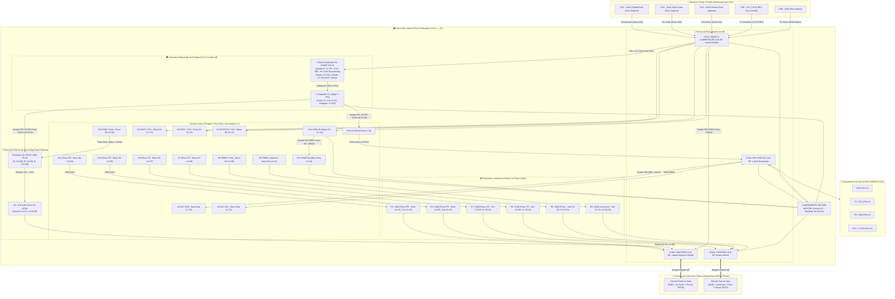

# Esquema de Ligação — Sistema de Luzes RC v8.4

[🇧🇷 **Versão em Português**](#-português) | [🇺🇸 **English Version (WIRING_SCHEMATIC.md)**](WIRING_SCHEMATIC.md) | [📜 **Premissas Oficiais (PREMISSAS_PROJETO.md)**](PREMISSAS_PROJETO.md)

---

## Português

Este documento detalha o mapeamento de pinos, o design da **Placa Shield Hub (em placa perfurada 5x7cm)** com os conectores do **Conjunto 1 (Linha MODU / Dupont 2.54mm em 90°)**, a interface I2C com o acelerômetro **MPU-6050 (GY-521)** nos pinos **A4/A5** (pinagem física 1:1 com o módulo: **GND, TX [SCL], RX [SDA], VCC**), a alimentação via **Canal 6 (CH6)** do receptor com **BEC de 6.0V**, o diodo retificador **D1 (1N4007 DO-41 com pitch padrão de 7.62mm na Col 17, Lin 15 a 18)** para redução imediata para um barramento seguro de **+5.25V** na **Linha 18**, o capacitor de filtragem **C1 (100µF x 25V na Linha 18, Cols 14-15)**, os **5 jumpers superiores isolados (W1 a W5)**, o **driver transistorizado Q1 (BC337 TO-92)** para os 4 faróis dianteiros, os **resistores diretos de 100Ω (R2 a R7)** e o barramento de **GND Mestre Unificado (Equilíbrio de Neutro)**.

---

### 🔌 1. Diagrama Geral de Blocos do Sistema


```mermaid
flowchart TD
    subgraph RECEPTOR["📡 Receptor FlySky FS-BS6 (Alimentado pelo ESC)"]
        RX_CH6_VCC["CH6 - VCC (+6.0V BEC Pino Central)"]
        RX_CH6_GND["CH6 - GND (Pino Inferior)"]
        RX_CH1["CH1 - Sinal Volante (Pino Superior)"]
        RX_CH2["CH2 - Sinal Throttle/Freio (Pino Superior)"]
        RX_CH4["CH4 - Sinal Chave Farol (Pino Superior)"]
    end

    subgraph MPU["🧭 Acelerômetro Inercial 3D MPU-6050 (GY-521)"]
        MPU_GND["GND (Pino 1)"]
        MPU_TX["TX / SCL (Pino 2)"]
        MPU_RX["RX / SDA (Pino 3)"]
        MPU_VCC["VCC / +5.25V (Pino 4)"]
    end

    subgraph SHIELD["🟢 Placa Hub / Shield (Placa Perfurada 5x7cm) — v8.4"]
        direction TB
        GND_BUS["⚡ BARRAMENTO DE GND MESTRE (Coluna 01 + Equilíbrio de Neutro)"]
        
        subgraph ENTRADA_PROTECAO["🛡️ Proteção e Regulação de Entrada (Col 17 e Linha 18)"]
            D1_DIODE["⚡ Diodo Retificador D1: 1N4007 DO-41\n[Queda Vf ~0.75V: +6.0V BEC ➔ +5.25V Barramento]\nÂnodo: (17,15) | Cátodo: (17,18) Pitch 7.62mm"]
            C1_FILTER["🔋 Capacitor C1 (100µF x 25V)\n[Linha 18, Cols 14-15 | Filtragem +5.25V]"]
        end
        
        subgraph ARDUINO["🔵 Arduino Nano (Pinagem Física Real: docs.arduino.cc)"]
            NANO_5V["Pino 5V (Barra Esq Lin 14)"]
            A4["A4 (I2C SDA - Barra Esq Lin 10)"]
            A5["A5 (I2C SCL - Barra Esq Lin 11)"]
            NANO_GND_L["Pino GND Esq (Barra Esq Lin 16)"]
            D2["D2 (INT0 / CH2 - Barra Dir Lin 13)"]
            D3["D3 (INT1 / CH4 - Barra Dir Lin 12)"]
            D4["D4 (PCINT20 / CH1 - Barra Dir Lin 11)"]
            D5["D5 (PWM / Lanterna - Barra Dir Lin 10)"]
            D6["D6 (PWM / Freio - Barra Dir Lin 09)"]
            D7["D7 (Pisca TE - Barra Dir Lin 08)"]
            D8["D8 (Pisca TD - Barra Dir Lin 07)"]
            D9["D9 (PWM / Farol - Barra Dir Lin 06)"]
            D10["D10 (Pisca FE - Barra Dir Lin 05)"]
            D11["D11 (Pisca FD - Barra Dir Lin 04)"]
            NANO_GND_R["Pino GND Dir (Barra Dir Lin 14)"]
        end

        subgraph FAROL_DRIVER["💡 Driver de Potência do Farol (High-Side Follower)"]
            Q1_TRANSISTOR["Transistor Q1: BC337 NPN TO-92\n[C: (13,09), B: (14,09), E: (15,09)]"]
            R_FAROL["R1: 27Ω 1/4W (Farol 4x LEDs)\n[Vertical Col 15, Lin 06-08]"]
        end

        subgraph RESISTORES["📦 Resistores Limitadores Diretos na Placa (1/4W)"]
            R_PISCA_FE["R2: 100Ω (Pisca FE - Horiz Lin 05, Cols 14-16)"]
            R_PISCA_FD["R3: 100Ω (Pisca FD - Horiz Lin 04, Cols 14-16)"]
            R_PISCA_TD["R7: 100Ω (Pisca TD - Vert Col 08, Lin 18-21)"]
            R_PISCA_TE["R6: 100Ω (Pisca TE - Vert Col 09, Lin 18-21)"]
            R_FREIO["R5: 100Ω (Freio - Vert Col 10, Lin 18-21)"]
            R_LANTERNA["R4: 100Ω (Lanternas - Vert Col 11, Lin 18-21)"]
        end

        subgraph CONECTORES_PLACA["🔌 Barras de Pinos Macho em 90°"]
            CON_RADIO["CON1: RÁDIO & ALIMENTAÇÃO (1x5 90° Lateral Direita)"]
            CON_FRENTE["CON2: DIANTEIRO (1x4 90° Lateral Superior Direita)"]
            CON_TRAS["CON3: TRASEIRO (1x6 90° Borda Inferior)"]
            CON_MPU["CON4: MPU-6050 I2C (1x4 90° Lateral Esquerda)"]
        end
    end

    subgraph CHICOTES["🚗 Chicotes da Carroceria / Bolha (Alojamentos MODU Fêmea)"]
        CHICOTE_DIANT["Chicote Frente (4 Vias)\n[GND + 4x Faróis + Piscas FE/FD]"]
        CHICOTE_TRAS["Chicote Trás (6 Vias)\n[GND + Lanternas + Freio + Piscas TE/TD]"]
    end

    %% Alimentação e Sinais vindos do Receptor
    RX_CH6_GND -->|"Fio Preto (GND Mestre)"| CON_RADIO
    RX_CH6_VCC -->|"Fio Vermelho (+6.0V BEC)"| CON_RADIO
    RX_CH1     -->|"Fio Branco (Sinal CH1)"| CON_RADIO
    RX_CH4     -->|"Fio Verde (Sinal CH4)"| CON_RADIO
    RX_CH2     -->|"Fio Amarelo (Sinal CH2)"| CON_RADIO

    %% Proteção e Regulação de Entrada D1 (Premissa #1 e #2)
    CON_RADIO -->|"Pino 1 [17,15] (+6.0V BEC)"| D1_DIODE
    D1_DIODE  -->|"Cátodo [17,18] (+5.25V)"| C1_FILTER

    %% Roteamento interno do CON1 (10mm diretos na lateral direita)
    CON_RADIO --> NANO_GND_R
    CON_RADIO --> D4
    CON_RADIO --> D3
    CON_RADIO --> D2

    %% Barramento Protegido +5.25V na Linha 18 (Jumpers W1 e W5)
    C1_FILTER -->|"Jumper W1 (+5.25V ~23mm de 15,18)"| NANO_5V
    C1_FILTER -->|"Jumper W5 (+5.25V Farol ~16mm de 16,18)"| Q1_TRANSISTOR

    %% Conexões MPU-6050 (Pinagem 1:1 na lateral esquerda)
    CON_MPU <--> MPU
    NANO_5V -->|"Trilha Verso (+5.25V)"| CON_MPU
    CON_MPU --> GND_BUS
    CON_MPU -->|"Jumper W4 (SDA ~11mm)"| A4
    CON_MPU -->|"Trilha 10mm"| A5

    %% GND Comum Unificado (Premissa #3)
    NANO_GND_R --- GND_BUS
    NANO_GND_R -->|"Jumper W3 (GND Cross-Tie ~16mm)"| NANO_GND_L
    CON_RADIO  -->|"Jumper W2 (GND Frente ~18mm)"| CON_FRENTE
    NANO_GND_L --- GND_BUS
    GND_BUS --- CON_RADIO
    GND_BUS --- C1_FILTER
    GND_BUS --- CON_TRAS
    GND_BUS --- CON_MPU

    %% Driver de Faróis (Q1 High-Side Emitter Follower)
    D9 -->|"Trilha Verso (Base ~0.4mA)"| Q1_TRANSISTOR
    Q1_TRANSISTOR -->|"Emissor (Ve ~ 4.3V)"| R_FAROL
    R_FAROL -->|"Saída (Col 15, Lin 06)"| CON_FRENTE

    %% Saídas para Piscas Dianteiros (Trilhas Diretas no Verso 5mm)
    D10 -->|"Trilha 5mm"| R_PISCA_FE   --> CON_FRENTE
    D11 -->|"Trilha 5mm"| R_PISCA_FD   --> CON_FRENTE

    %% Saídas para Resistores Traseiros (Trilhas em L no Verso)
    D5  --> R_LANTERNA   --> CON_TRAS
    D6  --> R_FREIO      --> CON_TRAS
    D7  --> R_PISCA_TE   --> CON_TRAS
    D8  --> R_PISCA_TD   --> CON_TRAS

    %% Saídas para Bolha
    CON_FRENTE <==|Engate Rápido 4P|==> CHICOTE_DIANT
    CON_TRAS   <==|Engate Rápido 6P|==> CHICOTE_TRAS
```

---

### 🗺️ 2. Layout Físico da Placa Hub / Shield (Placa Perfurada 5x7cm) — v8.4 com Suporte BEC 6.0V

```
┌─────────────────────────────────────────────────────────────────────────────┐
│               PLACA HUB SHIELD DE ILUMINAÇÃO (5x7 cm) - v8.4                │
│                                                                             │
│                      ┌─── [PORTA USB NANO] ───┐                             │
│                      │                        │                             │
│                      │  ARDUINO NANO V3 (DIP) │                             │
│                      │ (Encaixado em 2 barras │   (Col 17)                  │
│                      │   fêmeas de 1x15 pinos)│  ┌──────────────┐           │
│                      │                        │  │CON2: FRENTE  │           │
│                      │                        │  │(1x4 em 90°   │           │
│                      │                        │  │Lateral Dir)  │           │
│                      │  (Col 12)  (Col 14-16) │  │              │           │
│                      │   (o) [D12]            │  │              │           │
│                      │   (o) [D11]──[R3 100Ω]═╪═►│[4: Pis.FD]   │           │
│                      │   (o) [D10]──[R2 100Ω]═╪═►│[3: Pis.FE]   │           │
│                      │   (o) [D9] ──┐ [R1 27Ω]╪═►│[2: Farol]    │           │
│                      │   (o) [D8/PTD]│  │ (W2)──►│[1: GND]      │           │
│                      │   (o) [D7/PTE]│ [R1]   │  └──────────────┘           │
│                      │   (o) [D6/Fre]│  │     │   ▲ (Pinos 90° dir.)        │
│                      │   (o) [D5/Lan]▼ [Q1]   │                             │
│                      │              [C][B][E] │                             │
│                      │              (W5)(D9)(R1)                            │
│   ┌─────[A4/SDA](o)···(Jmp W4 SDA)─────┐      │   (o) [D4/CH1]────────────┐ │
│  ┌┼─────[A5/SCL](o)────────────────┐   │      │   (o) [D3/CH4]───────────┐│ │
│  ││     [A6]   (o)                 │   │      │   (o) [D2/CH2]──────────┐││ │
│  ││ ┌···[5V]   (o)◄──┼──(Jmp W1)───┼───┼──────┼───┐ (W1 In em 15,18)    │││ │
│  ││ │ ┌─[GND]  (o)···┼··(Jmp W3)───┼───┼──────┼───┼─────────────────────┼┼┼─┤
│  ││ │ │ [VIN]  (o)   │             │   │      │   │ (W2 In em 16,14)    │││ │
│  ││ │ │              │             │   │      │   │                     │││ │
│┌─┴┴─┴─┴─────┐        │             │   │      │   │  ┌─────────────────┐│││ │
││CON4: MPU   │        │             │   │      │   │  │CON1: RÁDIO & BEC││││ │
││(1x4 em 90° │        │             │   │      │   │  │(1x5 90° Lat Dir)││││ │
││Lateral Esq)│        │             │   │      │   │  │[5: CH1 Sinal]◄──┘││ │
││[1: GND]────┼────────┴─────────────┘   │      │   │  │[4: CH4 Sinal]◄───┘│ │
││[2: TX/SCL]◄┘                          │      │   │  │[3: CH2 Sinal]◄────┘ │
││[3: RX/SDA]◄···························┘      │   │  │[2: GND Comum]◄──────┤
││[4: VCC]◄───┘ (via ramal +5.25V Nano)         │   │  │[1: +6.0V BEC]◄───┐  │
│└┬─────────────────────────────────────┐       │   │  └┬─────────────────┼──┘
│ ▼ (Pinos 90°                          │       │   │   │ [D1 Ânodo 17,15]│   
│ para a esq.)                          │       │   │   │        │ (7.62mm)   
│                                       │       │   │   │        ▼ (Pitch)    
│                                       │      [C1-][C1+][W5]◄═[D1-K 17,18]   
│                                       ▼      (14) (15) (16)   (Linha 18 VCC)
│                                      [R7] [R6] [R5] [R4]                    
│                                      100Ω  100Ω 100Ω 100Ω                   
│                                      (PTD) (PTE)(Fre)(Lan)                  
│                                        │     │    │    │                    
│                                        ▼     ▼    ▼    ▼                    
│                                      ┌────────────────────────┐             
│                                      │ CON3: TRÁS (1x6 90°)   │             
│                                      │┌───┬───┬───┬───┬───┬──┐│             
│                                      ││PTD│PTE│Fre│Lan│NC │GND││             
│                                      │└───┴───┴───┴───┴───┴──┘│             
│                                      └────────────────────────┘             
│                                           (Pinos 90° apontam p/ baixo)      
└─────────────────────────────────────────────────────────────────────────────┘
```

---

### 📍 3. Pinagem dos Conectores (Conjunto 1 - Linha MODU 90°)

#### 📡 CON1: Conector do Receptor de Rádio e Alimentação (1x5 Pinos 90° — Lateral Direita)
*Posicionado na **Lateral Direita** (Coluna 17, Linhas 11 a 15), face a face com os pinos D4, D3, D2 e GND do Nano. O pino 1 (+6.0V BEC) alimenta o ânodo de D1 com ilha estritamente isolada no verso!*

| Pino | Identificação | Ligação no Shield | Ligação no Receptor FS-BS6 | Cor do Fio |
| :---: | :---: | :--- | :--- | :---: |
| **1** | **V_IN (+6.0V BEC)** | Ânodo de **D1 (1N4007)** no Pad (17, 15) [Trilha estritamente isolada no verso]. O diodo desce verticalmente na Coluna 17 (pitch padrão de 7.62 mm) até o Cátodo em (17, 18), alimentando o barramento **+5.25V protegido** na Linha 18 para **C1(+) em (15, 18)**, **W1 (+5.25V Nano)** em (15, 18) e **W5 (+5.25V Farol Q1)** em (16, 18). | **CH6 — Linha Central (Pino VCC +6.0V BEC)** | 🟥 Vermelho |
| **2** | **GND** | Trilha direta para **Nano GND Dir** (Col 12, Lin 14) $\rightarrow$ **GND Mestre Unificado** (Coluna 13) | **CH6 — Linha Inferior (Pino GND)** | ⬛ Preto |
| **3** | **CH2 (Sinal)** | **Nano D2** (Col 12, Lin 13) [10mm] | **CH2 — Linha Superior (Sinal Throttle)** | 🟨 Amarelo |
| **4** | **CH4 (Sinal)** | **Nano D3** (Col 12, Lin 12) [10mm] | **CH4 — Linha Superior (Sinal Chave Farol)**| 🟩 Verde |
| **5** | **CH1 (Sinal)** | **Nano D4** (Col 12, Lin 11) [10mm] | **CH1 — Linha Superior (Sinal Volante)** | ⬜ Branco |

---

#### 🧭 CON4: Conector do Acelerômetro MPU-6050 (1x4 Pinos 90° — Lateral Esquerda)
*Posicionado na **Lateral Esquerda** (Coluna 02, Linhas 10 a 13), com pinagem 1:1 idêntica à serigrafia do módulo do usuário (**GND, TX, RX, VCC**).*

| Pino | Identificação | Ligação no Shield | Ligação no MPU-6050 | Cor do Fio |
| :---: | :---: | :--- | :--- | :---: |
| **1** | **GND** | Ponte direta de solda (1 pad) para o **Barramento GND Mestre** (Col 01, Lin 10) | Pino GND do MPU-6050 | ⬛ Preto |
| **2** | **TX (SCL)** | Trilha direta horizontal no verso de apenas 10mm para **Nano A5** (Col 06, Lin 11) | Pino TX (Clock SCL) | 🟨 Amarelo |
| **3** | **RX (SDA)** | **Jumper W4 (~11mm)** na face superior para **Nano A4** (Col 06, Lin 10) cruzando SCL | Pino RX (Dados SDA) | 🟩 Verde |
| **4** | **VCC (+5.25V)** | Ramal no verso a partir de **Nano 5V** (Col 06, Lin 14 $\rightarrow$ Col 05, Lin 14 $\rightarrow$ Col 05, Lin 13 $\rightarrow$ Col 02, Lin 13) | Pino VCC (+5V tolerante) | 🟥 Vermelho |

---

#### 💡 CON2: Conector do Chicote Dianteiro (1x4 Pinos 90° — Lateral Superior Direita)
*Posicionado na **Lateral Superior Direita** (Coluna 17, Linhas 04 a 07) — mesmo lado do rádio, com pinos em 90° apontando para fora da borda direita.*

| Pino | Função | Componente na Placa | Destino na Bolha | Cor do Fio |
| :---: | :--- | :--- | :--- | :---: |
| **1** | **GND** | Alimentado por **Jumper W2** do GND Mestre em (16, 14) com ponte (16, 07) $\rightarrow$ (17, 07) | Negativo comum dos LEDs dianteiros | ⬛ Preto |
| **2** | **Faróis Dianteiros** | Pino D9 $\rightarrow$ Base Q1 BC337 $\rightarrow$ Emissor $\rightarrow$ Resistor R1 ($27\Omega$, Col 15, Lin 06-08) $\rightarrow$ Ponte 1 pad | Ânodo (+) dos 4 LEDs Brancos de Farol | ⬜ Branco |
| **3** | **Pisca Diant. Esq.** | Pino D10 $\rightarrow$ Trilha 5mm $\rightarrow$ Resistor R2 ($100\Omega$, Lin 05, Cols 14-16) $\rightarrow$ Ponte 1 pad | Ânodo (+) dos 2 LEDs Laranjas Esquerdos | 🟧 Laranja |
| **4** | **Pisca Diant. Dir.** | Pino D11 $\rightarrow$ Trilha 5mm $\rightarrow$ Resistor R3 ($100\Omega$, Lin 04, Cols 14-16) $\rightarrow$ Ponte 1 pad | Ânodo (+) dos 2 LEDs Laranjas Direitos | 🟦 Azul |

---

#### 💡 CON3: Conector do Chicote Traseiro (1x6 Pinos 90° — Borda Inferior Centro-Direita)
*Posicionado na **Linha 24, Colunas 08 a 13** com pinos em 90° apontando para baixo. Trilhas em L aninhadas com ZERO cruzamentos!*

| Pino | Função | Componente na Placa | Destino na Bolha | Cor do Fio |
| :---: | :--- | :--- | :--- | :---: |
| **1** | **Pisca Tras. Dir.** | Pino D8 $\rightarrow$ Resistor R7 ($100\Omega$, Col 08) | Ânodo (+) dos 2 LEDs Laranjas Traseiros Dir. | 🟦 Azul |
| **2** | **Pisca Tras. Esq.** | Pino D7 $\rightarrow$ Resistor R6 ($100\Omega$, Col 09) | Ânodo (+) dos 2 LEDs Laranjas Traseiros Esq. | 🟧 Laranja |
| **3** | **Luz de Freio** | Pino D6 $\rightarrow$ Resistor R5 ($100\Omega$, Col 10) | Ânodo (+) dos 2 LEDs de Freio Vermelhos | 🟥 Vermelho |
| **4** | **Lanternas** | Pino D5 $\rightarrow$ Resistor R4 ($100\Omega$, Col 11) | Ânodo (+) dos 2 LEDs de Lanterna Vermelhos | 🟫 Marrom |
| **5** | **Reserva / Guia** | Desconectado (NC, Col 12) | Pino cego / Guia mecânica / Expansão | ⚪ Cinza / Livre |
| **6** | **GND Comum** | Barramento GND Direto (Col 13) | Negativo comum dos LEDs traseiros | ⬛ Preto |

---

### 📦 4. Dimensionamento de Resistores, Diodo e Driver Transistorizado

| Componente | Canal / Função | LEDs Conectados | Valor | Posição na Placa | Orientação | Corrente Total | Corrente / LED | Potência |
| :---: | :---: | :--- | :---: | :---: | :---: | :---: | :---: | :---: |
| **D1 (1N4007)** | Entrada BEC | Proteção contra inversão e queda BEC | **$V_f \approx 0.75\,\text{V}$** | Coluna 17 (Linhas 15 a 18) | Vertical (Pitch 7.62mm) | ~110 a 230 mA | — | ~0.15 W (1A max) |
| **Q1 (BC337)** | D9 | Driver NPN TO-92 Faróis | — | Linha 09 (Colunas 13 a 15) | Vertical | 45 a 55 mA | — | ~35 mW |
| **R1** | D9 (Q1) | 4x LEDs Farol Branco em paralelo | **$27\Omega$** | Coluna 15 (Linhas 06 a 08) | Vertical | 45 a 55 mA | **11 a 14 mA** | ~0.08 W (1/4W) |
| **R2** | D10 | 2x LEDs Pisca Diant. Esq. em paralelo | **$100\Omega$** | Linha 05 (Colunas 14 a 16) | Horizontal | ~29 mA | **~14.5 mA** | ~0.08 W (1/4W) |
| **R3** | D11 | 2x LEDs Pisca Diant. Dir. em paralelo | **$100\Omega$** | Linha 04 (Colunas 14 a 16) | Horizontal | ~29 mA | **~14.5 mA** | ~0.08 W (1/4W) |
| **R7** | D8 | 2x LEDs Pisca Tras. Dir. em paralelo | **$100\Omega$** | Coluna 08 (Linhas 18 a 21) | Vertical | ~29 mA | **~14.5 mA** | ~0.08 W (1/4W) |
| **R6** | D7 | 2x LEDs Pisca Tras. Esq. em paralelo | **$100\Omega$** | Coluna 09 (Linhas 18 a 21) | Vertical | ~29 mA | **~14.5 mA** | ~0.08 W (1/4W) |
| **R5** | D6 | 2x LEDs Luz de Freio em paralelo | **$100\Omega$** | Coluna 10 (Linhas 18 a 21) | Vertical | ~29 mA | **~14.5 mA** | ~0.08 W (1/4W) |
| **R4** | D5 | 2x LEDs Lanterna em paralelo | **$100\Omega$** | Coluna 11 (Linhas 18 a 21) | Vertical | ~29 mA | **~14.5 mA** | ~0.08 W (1/4W) |

#### 🔬 Detalhamento Elétrico da Regulação e do Seguidor de Emissor:
- **Tensão BEC de Entrada:** +6.0V entregue pelo ESC via receptor (CON1 Pino 1).
- **Queda de Tensão no Diodo D1 (1N4007):** $V_f \approx 0.75\,\text{V}$ em condução contínua com carga de ~150–200mA.
- **Barramento Interno Protegido:** $V_{CC} = 6.0\,\text{V} - 0.75\,\text{V} = +5.25\,\text{V}$ (perfeitamente dentro do limite seguro absoluto de $5.5\,\text{V}$ do ATmega328P, chip USB e regulador LDO do MPU-6050).
- **Tensão de Base no Farol:** Pino D9 em nível alto entrega $\approx 5.0\text{ a }5.1\,\text{V}$.
- **Tensão de Emissor:** $V_E = V_B - V_{BE} \approx 5.05\,\text{V} - 0.7\,\text{V} \approx 4.35\,\text{V}$.
- **Queda nos Faróis Brancos:** $V_f \approx 3.0\text{ a }3.1\,\text{V}$.
- **Queda no Resistor R1:** $V_{R1} = 4.35\,\text{V} - 3.1\,\text{V} = 1.25\,\text{V}$.
- **Corrente Total dos Faróis:** $I_{R1} = \frac{1.25\,\text{V}}{27\,\Omega} \approx 46\text{ a }50\,\text{mA}$ (dividida por 4 LEDs = **11.5 a 12.5 mA por LED**, garantindo altíssimo brilho com estabilidade térmica impecável).
- **Corrente drenada do pino D9:** $I_B = \frac{I_E}{h_{FE} + 1} \approx \frac{48\,\text{mA}}{150} \approx 0.32\,\text{mA}$ (carga desprezível para o microcontrolador).
- **Vantagem de Arquitetura:** Preserva 100% o chicote dianteiro com fio de terra comum (GND), dispensando qualquer modificação na fiação da bolha!

---

## English

Consulte [WIRING_SCHEMATIC.md](WIRING_SCHEMATIC.md) para a documentação técnica completa em Inglês com o diagrama de blocos e especificações dos conectores.

