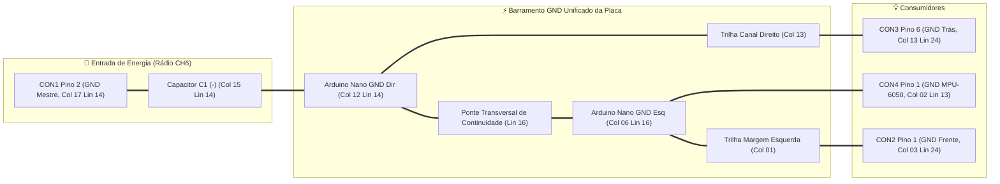

# Premissas de Projeto da Placa Shield Hub (5x7 cm) — Sistema de Luzes RC v7.2

[🇧🇷 **Versão em Português**](#-português) | [🇺🇸 **English Version (SHIELD_BOARD_LAYOUT.md)**](SHIELD_BOARD_LAYOUT.md)

---

## 🇧🇷 Português

Este documento estabelece as **premissas fundamentais e inegociáveis de engenharia** que regem o projeto elétrico, mecânico e térmico da **Placa Shield Hub** do Sistema de Luzes RC. Qualquer modificação no layout, fiação ou nos diagramas deve obrigatoriamente respeitar estas premissas.

---

### ⚡ Premissa #1: Origem Absoluta de Energia (VCC e GND)

Toda a alimentação elétrica da placa shield provém única e exclusivamente do **Receptor de Rádio FlySky FS-BS6** através do conector **CON1** (ligado à porta **Canal 6 / CH6**, alimentada pelo BEC interno do ESC do carro):

| Terminal do Rádio | Pino no CON1 | Função Elétrica | Tensão Recomendada | Capacidade Térmica / Consumo |
|---|:---:|---|:---:|:---:|
| Terminal do Rádio | Pino no CON1 | Função Elétrica | Tensão Recomendada | Capacidade Térmica / Consumo |
|---|:---:|---|:---:|:---:|
| **CH6 — Pino Central (Vermelho)** | **CON1 Pino 1** (Col 17, Lin 15) | **VCC Principal (BEC 5.0V)** | $+5.0\text{V}$ nominal ($+5.5\text{V}$ máx) | Conector: $3.0\text{A}$ \| Consumo total placa: $\sim 162\text{mA}$ |
| **CH6 — Pino Inferior (Preto)** | **CON1 Pino 2** (Col 17, Lin 14) | **GND Mestre (Referência 0V Central)** | $0\text{V}$ (Terra Mestre) | Conector: $3.0\text{A}$ \| Consumo total placa: $\sim 162\text{mA}$ |

> [!IMPORTANT]
> - **Tensão do BEC:** O BEC do ESC deve estar ajustado em **5.0V** (padrão de microcontroladores de 5V). Caso o ESC possua BEC fixo de 6.0V, recomenda-se inserir um diodo em série (ex: 1N4007 ou 1N5819 Schottky, queda de 0.4V a 0.7V) para manter a tensão dentro da faixa operacional segura do ATmega328P ($2.7\text{V} - 5.5\text{V}$) e do regulador interno do módulo GY-521.
> - **Consumo e Capacidade:** A placa completa consome no pior caso $\sim 162\text{mA}$ (todos os LEDs acesos ao mesmo tempo + Arduino Nano + MPU-6050), operando com folga absoluta tanto em relação ao conector (3A) quanto ao limite de corrente total das portas do ATmega328P (200mA).
> - **Nenhum outro conector fornece energia para a placa:** Nem os chicotes de LEDs (CON2 e CON3), nem o conector do acelerômetro (CON4), nem a porta USB do Arduino durante a operação no carro.
> - O pino **VIN** do Arduino Nano permanece **desconectado**. O microcontrolador é alimentado diretamente pelo seu pino **5V** (Coluna 06, Linha 14) através do VCC regulado do BEC.
> - O GND que entra pelo pino 2 do CON1 (Coluna 17, Linha 14) é o **ponto de terra zero de todo o veículo**, devendo ser tratado como o centro nevrálgico do barramento.

---

### 🔋 Premissa #2: Regulação e Filtragem Imediata na Entrada (Capacitor C1)

Em carros de controle remoto, os motores elétricos (escovados ou brushless) e o servo de direção de alto torque geram ruído eletromagnético severo, quedas instantâneas de tensão (*brownouts*) e picos indutivos na linha de alimentação do BEC.

Para garantir a máxima integridade de sinal:
1. **Localização Física Imediata:** O capacitor eletrolítico de desacoplamento **C1 ($100\mu\text{F} \times 16\text{V}$ a $220\mu\text{F} \times 16\text{V}$)** deve ser montado **diretamente nos terminais de entrada de CON1 (Coluna 15)**:
   - **Polo Positivo C1 (+):** Soldado na Coluna 15, Linha 15, interligado a **CON1 Pino 1 (+5V)** (Coluna 17, Linha 15).
   - **Polo Negativo C1 (-):** Soldado na Coluna 15, Linha 14, interligado a **CON1 Pino 2 (GND)** (Coluna 17, Linha 14) e ao pino **GND do Nano** (Coluna 12, Linha 14).
2. **Efeito Elétrico:** O capacitor atua como um reservatório local de energia e filtro passa-baixas **antes** que a tensão viaje pelo barramento até o Arduino Nano e o acelerômetro MPU-6050, eliminando oscilações de brilho nos faróis e reinicializações acidentais do microcontrolador durante arrancadas fortes.
3. **Capacitor Cerâmico Opcional de Alta Frequência:** Pode-se soldar em paralelo no verso um capacitor cerâmico multicamada de **$100\text{nF}$ (104)** entre os mesmos pinos para rejeitar ruídos na faixa de MHz.

---

### 🌐 Premissa #3: Barramento de Terra (GND) Mestre Unificado

O GND originário de **CON1 Pino 2 (Coluna 17, Linha 14)** deve ser distribuído através de uma **malha contínua e 100% interligada** na placa perfurada:

1. **Continuidade Independente:** A integridade do terra de todos os conectores (CON1, CON2, CON3 e CON4) deve existir na própria placa de circuito, **sem depender da presença do módulo Arduino Nano inserido no soquete**.
2. **Reforço de Solda:** As trilhas de GND e +5V são construídas com fio de cobre estanhado ou pernas de componentes dobradas e generosamente banhadas com estanho, formando barramentos de baixa resistência ($R < 0.05\,\Omega$).

---

### 📐 Premissa #4: Roteamento Híbrido Otimizado, Pinagem Real e 4 Jumpers Isolados Superiores

1. **Pinagem Física Real do Arduino Nano:**
   - O Arduino Nano é montado com o conector **USB Mini-B / Type-C voltado para a borda superior externa (Linhas 01-02)**.
   - **Barra Esquerda (Coluna 06, Linhas 03 a 17):** D13 no topo (Lin 03), 3V3, REF, A0, A1, A2, A3, A4/SDA (Lin 10), A5/SCL (Lin 11), A6, A7, 5V (Lin 14), RST, GND (Lin 16), VIN na base (Lin 17).
   - **Barra Direita (Coluna 12, Linhas 03 a 17):** D12 no topo (Lin 03), D11 (Pisca FD, Lin 04), D10 (Pisca FE, Lin 05), D9 (Farol, Lin 06), D8 (Pisca TD, Lin 07), D7 (Pisca TE, Lin 08), D6 (Freio, Lin 09), D5 (Lanterna, Lin 10), D4/CH1 (Lin 11), D3/CH4 (Lin 12), D2/CH2 (Lin 13), GND (Lin 14), RST, D0/RX, D1/TX na base (Lin 17).
2. **Trilhas Retas de 10mm no Verso (Face de Cobre):**
   - **CON1 (Rádio, Coluna 17, Linhas 11 a 15):** Borda lateral direita, face a face com D4 (CH1), D3 (CH4), D2 (CH2) e GND (Coluna 12, Linhas 11 a 14) $\rightarrow$ trilhas horizontais curtas de 10mm.
   - **CON4 (MPU-6050, Coluna 02, Linhas 10 a 13):** Borda lateral esquerda, face a face com A4 (SDA), A5 (SCL), +5V e GND (Coluna 06, Linhas 10 a 14/16) $\rightarrow$ trilhas horizontais curtas de 10mm.
   - **LEDs Traseiros (D5 a D8):** Trilhas em "L" aninhadas no verso descendo pelas Colunas 08 a 11 até R7 a R4 sem cruzamento.
   - **LED Pisca Dianteiro Direito (D11):** Desce no verso pelo canal central livre da Coluna 07 até R3.
3. **Necessidade Geométrica e Execução dos 4 Fios Isolados Superiores (Jumpers W1 a W4):**
   - Como todos os pinos de saída digital PWM/LED do Nano (D5 a D11) residem exclusivamente na barra direita (Coluna 12), mas os resistores dianteiros R1-R3 e os conectores CON2 e CON4 residem na metade esquerda da placa, é topologicamente impossível cruzar sinais entre os lados em placa universal de face simples sem pontes.
   - Para garantir **ZERO curtos-circuitos** e 100% de confiabilidade mecânica, 4 conexões são executadas com pequenos fios flexíveis isolados na **face superior** (face dos componentes):
     - **W1 (+5V Nano, ~13mm):** Ponto (Col 01, Lin 14) $\rightarrow$ Nano 5V (Col 06, Lin 14), saltando sobre o trilho de terra.
     - **W2 (Farol D9, ~36mm):** Nano D9 (Col 12, Lin 06) $\rightarrow$ R1 Top (Col 04, Lin 18), saltando sobre o corpo do Nano e barramento GND.
     - **W3 (Pisca Diant. Esq. D10, ~38mm):** Nano D10 (Col 12, Lin 05) $\rightarrow$ R2 Top (Col 05, Lin 18), saltando sobre o corpo do Nano e barramento GND.
     - **W4 (GND Cross-Tie, ~16mm):** Nano GND Dir (Col 12, Lin 14) $\rightarrow$ Nano GND Esq (Col 06, Lin 16), unindo os barramentos de terra esquerdo e direito sem cruzar trilhas no verso.

---

### 🔌 Premissa #5: Conectores em Ângulo Reto (90°) nas Bordas da Placa

Para que a placa caiba perfeitamente no chassi do carro sem pressionar a bolha de policarbonato:
1. Todos os conectores periféricos utilizam **barras de pinos macho em 90° (MODU / Dupont 2.54mm)** com as pontas viradas para fora da placa.
2. **CON1 (Rádio):** Aponta para a **borda lateral direita** (Coluna 17, Linhas 11 a 15).
3. **CON4 (MPU-6050):** Aponta para a **borda lateral esquerda** (Coluna 02, Linhas 10 a 13).
4. **CON2 (Frente) e CON3 (Traseira):** Apontam para a **borda inferior** (Linha 24).
5. **Conector USB do Arduino Nano:** Aponta para a **borda superior** (Linha 01), permitindo conectar o cabo USB para telemetria ou gravação de firmware sem retirar a placa do chassi.

Esta distribuição permite desconectar qualquer chicote individualmente em menos de 5 segundos na pista.
