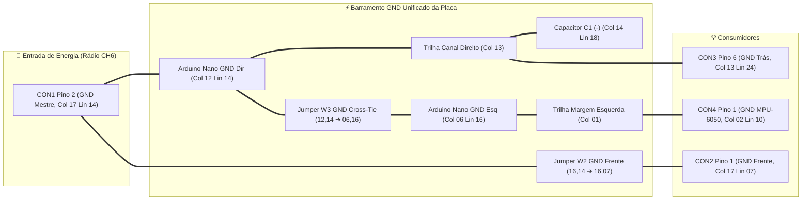

# Premissas de Projeto da Placa Shield Hub (5x7 cm) — Sistema de Luzes RC v8.4

[🇧🇷 **Versão em Português**](#-português) | [🇺🇸 **English Version (SHIELD_BOARD_LAYOUT.md)**](SHIELD_BOARD_LAYOUT.md)

---

## 🇧🇷 Português

Este documento estabelece as **premissas fundamentais e inegociáveis de engenharia** que regem o projeto elétrico, mecânico e térmico da **Placa Shield Hub** do Sistema de Luzes RC. Qualquer modificação no layout, fiação ou nos diagramas deve obrigatoriamente respeitar estas premissas.

---

### ⚡ Premissa #1: Origem Absoluta de Energia (BEC 6.0V, Diodo D1 e Barramento +5.25V Seguro)

Toda a alimentação elétrica da placa shield provém única e exclusivamente do **Receptor de Rádio FlySky FS-BS6** através do conector **CON1** (ligado à porta **Canal 6 / CH6**, alimentada pelo BEC interno do ESC do carro):

| Ponto Elétrico | Conexão Física na Placa | Função Elétrica | Tensão Operacional | Capacidade Térmica / Consumo |
|---|:---:|---|:---:|:---:|
| **CON1 Pino 1** | Coluna 17, Linha 15 | **Entrada VCC Bruta do BEC (Anodo D1)** | $+6.0\text{V}$ nominal ($+6.5\text{V}$ máx) | Conector: $3.0\text{A}$ \| Protegido por D1 |
| **Diodo D1 (1N4007)** | Col 17 Lin 15 $\rightarrow$ Col 17 Lin 18 | **Regulador de Queda (-0.75V, Pitch 7,62mm) & Proteção Reversa** | Queda $V_f \approx 0.75\text{V}$ | $1.0\text{A}$ contínuo ($30\text{A}$ pico) |
| **Barramento VCC Seguro** | Linha 18 (Cols 17 a 15) | **Alimentação Nano 5V, C1(+) e Coletor Q1** | $+5.25\text{V}$ nominal ($\le 5.5\text{V}$ seguro) | Consumo total placa: $\sim 210\text{mA}$ |
| **CON1 Pino 2** | Coluna 17, Linha 14 | **GND Mestre (Referência 0V Central)** | $0\text{V}$ (Terra Mestre) | Conector: $3.0\text{A}$ \| Consumo total placa: $\sim 210\text{mA}$ |

> [!IMPORTANT]
> - **Suporte Nativo a BEC de 6.0V com Diodo D1 Onboard (v8.4):** Para garantir compatibilidade com ESCs cujo BEC opere em **6.0V** (padrão de alta potência para servos rápidos), a placa integra descendo verticalmente na **Coluna 17 (Linhas 15 a 18)** um diodo retificador de silício **D1 (1N4007 DO-41)** com pitch padrão de 7,62 mm (3 passos). Ele produz uma queda de tensão direta de $V_f \approx 0.75\text{V}$, reduzindo os $+6.0\text{V}$ brutos para **$+5.25\text{V}$**, que é rigorosamente seguro para o pino 5V do Arduino Nano, para o ATmega328P, o chip USB CH340 e o sensor MPU-6050, mantendo 100% calibrados os resistores $R1$ ($27\,\Omega$) e $R2\text{--}R7$ ($100\,\Omega$).
> - **Isolamento Galvânico Total:** O ânodo de D1 em `(17, 15)` fica a mais de 7 mm de distância do cátodo em `(17, 18)`. Os pads intermediários ficam desocupados, eliminando qualquer risco de escorrimento de estanho.
> - **Proteção contra Inversão de Polaridade:** Como bônus de engenharia, o diodo D1 impede qualquer dano à eletrônica em caso de conexão invertida do cabo do rádio.
> - **Consumo e Capacidade:** A placa completa consome no pior caso $\sim 210\text{mA}$ (Farol a 60mA via transistor Q1 + todos os LEDs acesos a 30mA por canal + Arduino Nano + MPU-6050), dissipando apenas $\sim 150\text{mW}$ em D1 (que suporta até 1000mW e 1.0A contínuo).
> - **Nenhum outro conector fornece energia para a placa:** Nem os chicotes de LEDs (CON2 e CON3), nem o conector do acelerômetro (CON4), nem a porta USB do Arduino durante a operação no carro.
> - O pino **VIN** do Arduino Nano permanece **desconectado**. O microcontrolador é alimentado diretamente pelo seu pino **5V** (Coluna 06, Linha 14) através do barramento protegido de $+5.25\text{V}$ via jumper superior W1.
> - O GND que entra pelo pino 2 do CON1 (Coluna 17, Linha 14) é o **ponto de terra zero de todo o veículo**, devendo ser tratado como o centro nevrálgico do barramento.

---

### 🔋 Premissa #2: Regulação D1 e Filtragem C1 na Linha 18 com Pitch Expandido

Em carros de controle remoto, os motores elétricos (escovados ou brushless) e o servo de direção de alto torque geram ruído eletromagnético severo, quedas instantâneas de tensão (*brownouts*) e picos indutivos na linha de alimentação do BEC.

Para garantir a máxima integridade de sinal e montagem sem risco de curtos:
1. **Localização Física na Coluna 17 e Linha 18:** 
   - **Diodo D1 (1N4007):** Montado na face superior descendo pela Coluna 17 entre a Linha 15 e a Linha 18 com pitch padrão de 7,62 mm (3 passos). O terminal **Anodo** é inserido no Pad `(17, 15)` (soldado ao pino 1 do CON1). O terminal **Catodo (faixa prateada)** é inserido no Pad `(17, 18)`.
   - **Isolamento no Verso:** O Pad `(17, 15)` fica **rigorosamente isolado no verso**, e os pads intermediários `(17, 16)`, `(17, 17)`, `(16, 15)` e `(15, 15)` ficam 100% livres, criando um vão de mais de 7 mm contra pontes de solda acidentais. A trilha de solda de VCC no verso é restrita entre `(17, 18)` e `(15, 18)` na Linha 18.
   - **Capacitor C1 ($100\mu\text{F} \times 25\text{V}$):** Montado diretamente na Linha 18 nos Pads `(15, 18)` e `(14, 18)`.
     - **Polo Positivo C1 (+):** Soldado no Pad `(15, 18)` (ligado ao Catodo de D1 via trilha da Linha 18, ao Jumper W1 para Nano 5V e, via nó `(16, 18)`, ao Jumper W5 para Q1 Coletor).
     - **Polo Negativo C1 (-):** Soldado no Pad `(14, 18)` (ligado por ponte direta de 1 pad ao tronco de GND da Coluna 13).
2. **Efeito Elétrico Combinado:** O diodo D1 fornece a queda de tensão e proteção reversa, enquanto o capacitor C1 atua como reservatório local de desacoplamento antes que a energia alcance o microcontrolador e o sensor inercial, eliminando oscilações de brilho e reinicializações sob forte aceleração.

---

### 🌐 Premissa #3: Barramento de Terra (GND) Mestre Unificado

O GND originário de **CON1 Pino 2 (Coluna 17, Linha 14)** deve ser distribuído através de uma **malha contínua e 100% interligada** na placa perfurada:

1. **Continuidade Independente:** A integridade do terra de todos os conectores (CON1, CON2, CON3 e CON4) deve existir na própria placa de circuito, **sem depender da presença do módulo Arduino Nano inserido no soquete**.
2. **Reforço de Solda:** As trilhas de GND e +5V são construídas com fio de cobre estanhado ou pernas de componentes dobradas e generosamente banhadas com estanho, formando barramentos de baixa resistência ($R < 0.05\,\Omega$).

---

### 📐 Premissa #4: Roteamento Híbrido, Diodo D1 (1N4007), Driver Farol Q1 (BC337), Resistores 100Ω e 5 Jumpers Superiores

1. **Pinagem Física Real do Arduino Nano:**
   - O Arduino Nano é montado com o conector **USB Mini-B / Type-C voltado para a borda superior externa (Linhas 01-02)**.
   - **Barra Esquerda (Coluna 06, Linhas 03 a 17):** D13 no topo (Lin 03), 3V3, REF, A0, A1, A2, A3, A4/SDA (Lin 10), A5/SCL (Lin 11), A6, A7, 5V (Lin 14), RST, GND (Lin 16), VIN na base (Lin 17).
   - **Barra Direita (Coluna 12, Linhas 03 a 17):** D12 no topo (Lin 03), D11 (Pisca FD, Lin 04), D10 (Pisca FE, Lin 05), D9 (Farol, Lin 06), D8 (Pisca TD, Lin 07), D7 (Pisca TE, Lin 08), D6 (Freio, Lin 09), D5 (Lanterna, Lin 10), D4/CH1 (Lin 11), D3/CH4 (Lin 12), D2/CH2 (Lin 13), GND (Lin 14), RST, D0/RX, D1/TX na base (Lin 17).
2. **Diodo Onboard D1 (1N4007) com Pitch Expandido (Coluna 17, Linhas 15 a 18):**
   - Inserido entre Col 17 Lin 15 (Anodo, ligado a CON1 P1) e Col 17 Lin 18 (Catodo, ligado a C1+, W1 e W5 via trilha na Linha 18). Pad (17, 15) isolado no verso. Reduz 6.0V para +5.25V seguros com proteção reversa e vão de 7,62 mm contra curtos.
3. **Driver de Transistor Q1 (BC337 NPN) para Faróis Dianteiros (High-Side Emitter Follower):**
   - Os 4 LEDs brancos de farol em paralelo demandam de 50 a 65 mA. Como o limite do pino do ATmega328P é 30-40 mA, o canal de Farol utiliza um transistor **BC337 (TO-92 NPN)** operando em seguidor de emissor:
     - **Coletor (Pino 1, Col 13 Lin 09):** Conectado aos $+5.25\text{V}$ protegidos via Jumper W5 (vindo de 16, 18).
     - **Base (Pino 2, Col 14 Lin 09):** Excitada pelo pino **Nano D9** (`12, 06`) através de trilha de solda $\rightarrow$ drena apenas $\sim 0.4\text{mA}$ do microcontrolador.
     - **Emissor (Pino 3, Col 15 Lin 09):** Fornece $V_E \approx 5.25\text{V} - 0.7\text{V} \approx 4.3\text{–}4.5\text{V}$ ao resistor $R1$.
     - **Resistor R1 ($27\,\Omega$ 1/4W):** Montado verticalmente na Coluna 15 (Linhas 08 a 06, pitch de 5,08mm). Tensão sobre $R1 \approx 4.3\text{V} - 3.1\text{V} = 1.2\text{V} \rightarrow I \approx 45\text{–}55\text{mA}$ (dobro do brilho original!).
     - **Dissipação Q1:** $\approx 35\text{mW}$ (opera frio, limite nominal 625mW).
4. **Padronização dos Canais Diretos em $100\,\Omega$ 1/4W (R2 a R7):**
   - **Piscas FE/FD e TE/TD e Freio:** 2 LEDs em paralelo por canal $\rightarrow I_{total} \approx 29\text{–}30\text{mA}$ ($\approx 14.5\text{–}15\text{mA}$ por LED), atingindo luminosidade máxima com segurança total para as portas I/O do Nano.
   - **Lanterna Traseira (D5):** Resistor $100\,\Omega$ com PWM via software a 40% (`analogWrite(102)` / `BRIGHTNESS_40`) em meia-luz (`HL_DIM`) e 100% (`BRIGHTNESS_100`) em farol alto (`HL_FULL`), com transição suave (*fade* de ~300ms via `updateTailLightFade()`).
5. **Execução dos 5 Fios Isolados Superiores (Jumpers W1 a W5):**
   - Para garantir **ZERO curtos-circuitos** e 100% de confiabilidade mecânica, apenas 5 conexões utilizam fios flexíveis isolados na **face superior** (face dos componentes):
     - **W1 (+5.25V Nano, ~23mm):** C1(+) / W1 In (Col 15, Lin 18) $\rightarrow$ Nano 5V (Col 06, Lin 14).
     - **W2 (GND Dianteiro, ~18mm):** GND Mestre (Col 16, Lin 14) $\rightarrow$ CON2 P1 (Col 16, Lin 07 $\rightarrow$ ponte para Col 17 Lin 07).
     - **W3 (GND Cross-Tie, ~16mm):** Nano GND Dir (Col 12, Lin 14) $\rightarrow$ Nano GND Esq (Col 06, Lin 16), unindo os barramentos de terra esquerdo e direito.
     - **W4 (SDA/RX Acelerômetro, ~11mm):** CON4 P3 (Col 02, Lin 12) $\rightarrow$ Nano A4 (Col 06, Lin 10), garantindo isolamento galvânico perfeito sobre a trilha de SCL.
     - **W5 (+5.25V Farol Coletor Q1, ~16mm):** Barramento VCC (Col 16, Lin 18) $\rightarrow$ Q1 Coletor (Col 13, Lin 09).

---

### 🔌 Premissa #5: Conectores em Ângulo Reto (90°) nas Bordas da Placa

Para que a placa caiba perfeitamente no chassi do carro sem pressionar a bolha de policarbonato:
1. Todos os conectores periféricos utilizam **barras de pinos macho em 90° (MODU / Dupont 2.54mm)** com as pontas viradas para fora da placa.
2. **CON1 (Rádio):** Aponta para a **borda lateral direita** (Coluna 17, Linhas 11 a 15).
3. **CON2 (Chicote Dianteiro):** Aponta para a **borda lateral superior direita** (Coluna 17, Linhas 04 a 07) — **mesmo lado do rádio**.
4. **CON4 (MPU-6050 v8.1):** Aponta para a **borda lateral esquerda** (Coluna 02, Linhas 10 a 13) — Pinagem física: P1 GND (Lin 10), P2 TX [SCL] (Lin 11), P3 RX [SDA] (Lin 12), P4 VCC (Lin 13).
5. **CON3 (Chicote Traseiro):** Aponta para a **borda inferior** (Linha 24, Colunas 08 a 13).
6. **Conector USB do Arduino Nano:** Aponta para a **borda superior** (Linhas 01 a 02), permitindo conectar o cabo USB para telemetria ou gravação de firmware sem retirar a placa do chassi.

Esta distribuição permite desconectar qualquer chicote individualmente em menos de 5 segundos na pista.

