# Wiring Diagram & Shield Board Schematic — RC Light System v8.4

[🇧🇷 **Versão em Português (ESQUEMA_LIGACAO.md)**](ESQUEMA_LIGACAO.md) | [🇺🇸 **English Version**](#-english) | [📜 **Official Premises (PREMISSAS_PROJETO.md)**](PREMISSAS_PROJETO.md)

---

## 🇺🇸 English

This document provides the complete pin mapping, **Hub Shield Board layout (5x7cm perfboard)** with **MODU / Dupont 2.54mm 90° angled pin headers**, the integrated power supply via **Receiver Channel 6 (CH6)** with **6.0V BEC**, the **D1 (1N4007 DO-41)** rectifier diode with expanded 7.62mm pitch dropping the raw input by $\approx 0.75\text{V}$ to a safe **+5.25V internal bus on Row 18**, the **MPU-6050 (GY-521)** I2C inertial bus on pins **A4/A5** (physical 1:1 pinout with the module: **GND, TX [SCL], RX [SDA], VCC**), the **5 top insulated jumper wires (W1 to W5)**, the **Q1 (BC337 TO-92) transistorized driver** for the 4 front headlights, the **direct 100Ω resistors (R2 to R7)**, and the **Unified Master Ground Rail (Neutral Balance)**.

---

### 🔌 1. System Block Diagram

```mermaid
flowchart TD
    subgraph RECEIVER["📡 FlySky FS-BS6 Receiver (Powered by ESC BEC)"]
        RX_CH6_VCC["CH6 - VCC (+6.0V BEC Center Pin)"]
        RX_CH6_GND["CH6 - GND (Bottom Pin)"]
        RX_CH1["CH1 - Steering Signal (Top Pin)"]
        RX_CH2["CH2 - Throttle/Brake Signal (Top Pin)"]
        RX_CH4["CH4 - Headlight Switch Signal (Top Pin)"]
    end

    subgraph MPU["🧭 MPU-6050 (GY-521) 3D Inertial Accelerometer"]
        MPU_GND["GND (Pin 1)"]
        MPU_TX["TX / SCL (Pin 2)"]
        MPU_RX["RX / SDA (Pin 3)"]
        MPU_VCC["VCC / +5.25V (Pin 4)"]
    end

    subgraph SHIELD["🟢 Hub Shield Board (5x7cm Perfboard) — v8.4"]
        direction TB
        GND_BUS["⚡ MASTER GND BUS (Column 01 + Neutral Balance)"]
        
        subgraph POWER_REGULATION["🛡️ Input Protection & Regulation (Col 17, Rows 15-18)"]
            D1_DIODE["⚡ Rectifier Diode D1: 1N4007 DO-41\n[Vf ~0.75V Drop: +6.0V BEC ➔ +5.25V Bus]\nAnode: (17,15) | Cathode: (17,18) Pitch 7.62mm"]
            C1_FILTER["🔋 Capacitor C1 (100µF x 25V)\n[Row 18, Cols 14-15 | +5.25V Filtering]"]
        end
        
        subgraph ARDUINO["🔵 Arduino Nano (Real Physical Pinout: docs.arduino.cc)"]
            NANO_5V["5V Pin (Left Header Row 14)"]
            A4["A4 (I2C SDA - Left Header Row 10)"]
            A5["A5 (I2C SCL - Left Header Row 11)"]
            NANO_GND_L["GND Pin Left (Left Header Row 16)"]
            D2["D2 (INT0 / CH2 - Right Header Row 13)"]
            D3["D3 (INT1 / CH4 - Right Header Row 12)"]
            D4["D4 (PCINT20 / CH1 - Right Header Row 11)"]
            D5["D5 (PWM / Tail - Right Header Row 10)"]
            D6["D6 (PWM / Brake - Right Header Row 09)"]
            D7["D7 (Blinker RL - Right Header Row 08)"]
            D8["D8 (Blinker RR - Right Header Row 07)"]
            D9["D9 (PWM / Headlights - Right Header Row 06)"]
            D10["D10 (Blinker FL - Right Header Row 05)"]
            D11["D11 (Blinker FR - Right Header Row 04)"]
            NANO_GND_R["GND Pin Right (Right Header Row 14)"]
        end

        subgraph HEADLIGHT_DRIVER["💡 Headlight Power Driver (High-Side Follower)"]
            Q1_TRANSISTOR["Transistor Q1: BC337 NPN TO-92\n[C: (13,09), B: (14,09), E: (15,09)]"]
            R_FAROL["R1: 27Ω 1/4W (Headlights 4x LEDs)\n[Vertical Col 15, Rows 06-08]"]
        end

        subgraph RESISTORS["📦 Direct On-Board Current Limiting Resistors (1/4W)"]
            R_PISCA_FE["R2: 100Ω (Blinker FL - Horiz Row 05, Cols 14-16)"]
            R_PISCA_FD["R3: 100Ω (Blinker FR - Horiz Row 04, Cols 14-16)"]
            R_PISCA_TD["R7: 100Ω (Blinker RR - Vert Col 08, Rows 18-21)"]
            R_PISCA_TE["R6: 100Ω (Blinker RL - Vert Col 09, Rows 18-21)"]
            R_FREIO["R5: 100Ω (Brake Lights - Vert Col 10, Rows 18-21)"]
            R_LANTERNA["R4: 100Ω (Tail Lights - Vert Col 11, Rows 18-21)"]
        end

        subgraph HEADERS["🔌 90° Angled Male Pin Headers"]
            CON_RADIO["CON1: RADIO & POWER (1x5 90° Right Edge)"]
            CON_FRENTE["CON2: FRONT HARNESS (1x4 90° Upper-Right Edge)"]
            CON_TRAS["CON3: REAR HARNESS (1x6 90° Bottom Edge)"]
            CON_MPU["CON4: MPU-6050 I2C (1x4 90° Left Edge)"]
        end
    end

    subgraph HARNESSES["🚗 Body Shell Harnesses (Female MODU Housings)"]
        CHICOTE_DIANT["Front Harness (4 Pins)\n[GND + 4x Headlights + Front Blinkers]"]
        CHICOTE_TRAS["Rear Harness (6 Pins)\n[GND + Tail + Brake + Rear Blinkers]"]
    end

    %% Power and signals from receiver
    RX_CH6_GND -->|"Black Wire (Master GND)"| CON_RADIO
    RX_CH6_VCC -->|"Red Wire (+6.0V BEC)"| CON_RADIO
    RX_CH1     -->|"White Wire (CH1 Signal)"| CON_RADIO
    RX_CH4     -->|"Green Wire (CH4 Signal)"| CON_RADIO
    RX_CH2     -->|"Yellow Wire (CH2 Signal)"| CON_RADIO

    %% Input Protection & Regulation D1 (Premises #1 and #2)
    CON_RADIO -->|"Pin 1 [17,15] (+6.0V BEC)"| D1_DIODE
    D1_DIODE  -->|"Cathode [17,18] (+5.25V)"| C1_FILTER

    %% Direct internal routing (10mm short traces on right edge)
    CON_RADIO --> NANO_GND_R
    CON_RADIO --> D4
    CON_RADIO --> D3
    CON_RADIO --> D2

    %% Protected +5.25V Bus on Row 18 (Jumpers W1 and W5)
    C1_FILTER -->|"Jumper W1 (+5.25V ~23mm from 15,18)"| NANO_5V
    C1_FILTER -->|"Jumper W5 (+5.25V Headlights ~16mm from 16,18)"| Q1_TRANSISTOR

    %% MPU-6050 connections (1:1 Pinout on left edge)
    CON_MPU <--> MPU
    NANO_5V -->|"Underside Trace (+5.25V)"| CON_MPU
    CON_MPU --> GND_BUS
    CON_MPU -->|"Jumper W4 (SDA ~11mm)"| A4
    CON_MPU -->|"10mm Trace"| A5

    %% Unified Common Ground (Premise #3)
    NANO_GND_R --- GND_BUS
    NANO_GND_R -->|"Jumper W3 (GND Cross-Tie ~16mm)"| NANO_GND_L
    CON_RADIO  -->|"Jumper W2 (Front GND ~18mm)"| CON_FRENTE
    NANO_GND_L --- GND_BUS
    GND_BUS --- CON_RADIO
    GND_BUS --- C1_FILTER
    GND_BUS --- CON_TRAS
    GND_BUS --- CON_MPU

    %% Headlight Driver (Q1 High-Side Emitter Follower)
    D9 -->|"Underside Trace (Base ~0.4mA)"| Q1_TRANSISTOR
    Q1_TRANSISTOR -->|"Emitter (Ve ~ 4.3V)"| R_FAROL
    R_FAROL -->|"Output (Col 15, Row 06)"| CON_FRENTE

    %% Outputs to Front Resistors (Direct 5mm Underside Traces)
    D10 -->|"5mm Trace"| R_PISCA_FE   --> CON_FRENTE
    D11 -->|"5mm Trace"| R_PISCA_FD   --> CON_FRENTE

    %% Outputs to Rear Resistors (Nested L-traces on underside)
    D5  --> R_LANTERNA   --> CON_TRAS
    D6  --> R_FREIO      --> CON_TRAS
    D7  --> R_PISCA_TE   --> CON_TRAS
    D8  --> R_PISCA_TD   --> CON_TRAS

    %% Outputs to Body Shell
    CON_FRENTE <==|4P Quick Disconnect|==> CHICOTE_DIANT
    CON_TRAS   <==|6P Quick Disconnect|==> CHICOTE_TRAS
```



---

### 🗺️ 2. Hub Shield Board Physical Layout (5x7cm Perfboard) — v8.4 with 6.0V BEC Support

```
┌─────────────────────────────────────────────────────────────────────────────┐
│                  LIGHTING HUB SHIELD BOARD (5x7 cm) - v8.4                  │
│                                                                             │
│                        ┌─── [NANO USB PORT] ────┐                           │
│                        │                        │                           │
│                        │  ARDUINO NANO V3 (DIP) │                           │
│                        │ (Socketed in 2 rows of │   (Col 17)                │
│                        │  1x15 female headers)  │  ┌──────────────┐         │
│                        │                        │  │CON2: FRONT   │         │
│                        │                        │  │(1x4 90°      │         │
│                        │                        │  │Right Edge)   │         │
│                        │  (Col 12)  (Col 14-16) │  │              │         │
│                        │   (o) [D12]            │  │              │         │
│                        │   (o) [D11]──[R3 100Ω]═╪═►│[4: B.FR]     │         │
│                        │   (o) [D10]──[R2 100Ω]═╪═►│[3: B.FL]     │         │
│                        │   (o) [D9] ──┐ [R1 27Ω]╪═►│[2: Head]     │         │
│                        │   (o) [D8/BRR]│  │ (W2)──►│[1: GND]      │         │
│                        │   (o) [D7/BRL]│ [R1]   │  └──────────────┘         │
│                        │   (o) [D6/Brk]│  │     │   ▲ (90° Pins right)      │
│                        │   (o) [D5/Tai]▼ [Q1]   │                           │
│                        │              [C][B][E] │                           │
│                        │              (W5)(D9)(R1)                          │
│   ┌─────[A4/SDA](o)···(Jmp W4 SDA)─────┐      │   (o) [D4/CH1]────────────┐ │
│  ┌┼─────[A5/SCL](o)────────────────┐   │      │   (o) [D3/CH4]───────────┐│ │
│  ││     [A6]   (o)                 │   │      │   (o) [D2/CH2]──────────┐││ │
│  ││ ┌···[5V]   (o)◄──┼──(Jmp W1)───┼───┼──────┼───┐ (W1 In at 15,18)    │││ │
│  ││ │ ┌─[GND]  (o)···┼··(Jmp W3)───┼───┼──────┼───┼─────────────────────┼┼┼─┤
│  ││ │ │ [VIN]  (o)   │             │   │      │   │ (W2 In at 16,14)    │││ │
│  ││ │ │              │             │   │      │   │                     │││ │
│┌─┴┴─┴─┴─────┐        │             │   │      │   │  ┌─────────────────┐│││ │
││CON4: MPU   │        │             │   │      │   │  │CON1: RADIO & BEC││││ │
││(1x4 90°    │        │             │   │      │   │  │(1x5 90° R.Edge) ││││ │
││Left Edge)  │        │             │   │      │   │  │[5: CH1 Signal]◄─┘││ │
││[1: GND]────┼────────┴─────────────┘   │      │   │  │[4: CH4 Signal]◄──┘│ │
││[2: TX/SCL]◄┘                          │      │   │  │[3: CH2 Signal]◄───┘ │
││[3: RX/SDA]◄···························┘      │   │  │[2: Master GND]◄─────┤
││[4: VCC]◄───┘ (via Nano +5.25V branch)        │   │  │[1: +6.0V BEC]◄───┐  │
│└┬─────────────────────────────────────┐       │   │  └┬─────────────────┼──┘
│ ▼ (90° Pins                           │       │   │   │ [D1 Anode 17,15]│   
│ point left)                           │       │   │   │        │ (7.62mm)   
│                                       │       │   │   │        ▼ (Pitch)    
│                                       │      [C1-][C1+][W5]◄═[D1-K 17,18]   
│                                       ▼      (14) (15) (16)   (Row 18 VCC)  
│                                      [R7] [R6] [R5] [R4]                    
│                                      100Ω  100Ω 100Ω 100Ω                   
│                                      (BRR) (BRL)(Brk)(Tai)                  
│                                        │     │    │    │                    
│                                        ▼     ▼    ▼    ▼                    
│                                      ┌────────────────────────┐             
│                                      │ CON3: REAR (1x6 90°)   │             
│                                      │┌───┬───┬───┬───┬───┬──┐│             
│                                      ││BRR│BRL│Brk│Tai│NC │GND││             
│                                      │└───┴───┴───┴───┴───┴──┘│             
│                                      └────────────────────────┘             
│                                           (90° Pins point downward)         
└─────────────────────────────────────────────────────────────────────────────┘
```

---

### 📍 3. Pin Headers Mapping (MODU 90° Angled)

#### 📡 CON1: Radio Receiver & Main Power Connector (1x5 90° — Right Board Edge)
*Located at **Right Edge** (Column 17, Rows 11 to 15), facing Nano pins D4, D3, D2, and GND. Pin 1 (+6.0V BEC) feeds the anode of D1 on a strictly isolated underside pad!*

| Pin | Name | Board Connection | Receiver FS-BS6 Pin | Wire Color |
| :---: | :---: | :--- | :--- | :---: |
| **1** | **V_IN (+6.0V BEC)** | Anode of **D1 (1N4007)** at Pad (17, 15) [Underside strictly isolated]. Diode descends vertically to Cathode at (17, 18) with standard 7.62 mm pitch, feeding the **+5.25V protected** bus on Row 18 for **C1(+)**, **W1 (+5.25V Nano)**, and **W5 (+5.25V Headlight Q1 Collector)**. | **CH6 — Center Pin (+6.0V BEC)** | 🟥 Red |
| **2** | **GND** | Direct trace to **Nano GND Right** (Col 12, Row 14) $\rightarrow$ **Unified Master GND** | **CH6 — Bottom Pin (GND)** | ⬛ Black |
| **3** | **CH2 (Signal)** | **Nano D2** (Col 12, Row 13) [10mm] | **CH2 — Top Pin (Throttle Signal)** | 🟨 Yellow |
| **4** | **CH4 (Signal)** | **Nano D3** (Col 12, Row 12) [10mm] | **CH4 — Top Pin (Aux Headlight Switch)**| 🟩 Green |
| **5** | **CH1 (Signal)** | **Nano D4** (Col 12, Row 11) [10mm] | **CH1 — Top Pin (Steering Signal)** | ⬜ White |

---

#### 🧭 CON4: MPU-6050 Accelerometer Connector (1x4 90° — Left Board Edge)
*Located at **Left Edge** (Column 02, Rows 10 to 13), matching the exact silkscreen pinout of the user's sensor (**GND, TX, RX, VCC**).*

| Pin | Name | Board Connection | MPU-6050 Module Pin | Wire Color |
| :---: | :---: | :--- | :--- | :---: |
| **1** | **GND** | Direct 1-pad solder bridge to **Master GND Bus** (Col 01, Row 10) | MPU-6050 GND Pin | ⬛ Black |
| **2** | **TX (SCL)** | Direct 10mm horizontal underside trace to **Nano A5** (Col 06, Row 11) | TX Pin (I2C Clock SCL) | 🟨 Yellow |
| **3** | **RX (SDA)** | **Jumper W4 (~11mm)** on top side to **Nano A4** (Col 06, Row 10) crossing SCL | RX Pin (I2C Data SDA) | 🟩 Green |
| **4** | **VCC (+5.25V)** | Underside branch from **Nano 5V** (Col 06, Row 14 $\rightarrow$ Col 05, Row 14 $\rightarrow$ Col 05, Row 13 $\rightarrow$ Col 02, Row 13) | VCC Pin (+5V tolerant) | 🟥 Red |

---

#### 💡 CON2: Front Light Harness Connector (1x4 90° — Upper-Right Edge)
*Located at **Upper-Right Edge** (Column 17, Rows 04 to 07) — same side as radio, with 90° pins pointing outward to the right.*

| Pin | Function | Board Component | Body Shell Target | Wire Color |
| :---: | :--- | :--- | :--- | :---: |
| **1** | **GND** | Fed by **Jumper W2** from Master GND at (16, 14) with bridge (16, 07) $\rightarrow$ (17, 07) | Common negative for front LEDs | ⬛ Black |
| **2** | **Headlights** | Pin D9 $\rightarrow$ Q1 BC337 Base $\rightarrow$ Emitter $\rightarrow$ Resistor R1 ($27\Omega$, Col 15, Rows 06-08) $\rightarrow$ 1-pad bridge | Anode (+) of 4x White Headlight LEDs | ⬜ White |
| **3** | **Front Left Blinker** | Pin D10 $\rightarrow$ 5mm trace $\rightarrow$ Resistor R2 ($100\Omega$, Row 05, Cols 14-16) $\rightarrow$ 1-pad bridge | Anode (+) of 2x Front Left Amber LEDs | 🟧 Orange |
| **4** | **Front Right Blinker**| Pin D11 $\rightarrow$ 5mm trace $\rightarrow$ Resistor R3 ($100\Omega$, Row 04, Cols 14-16) $\rightarrow$ 1-pad bridge | Anode (+) of 2x Front Right Amber LEDs| 🟦 Blue |

---

#### 💡 CON3: Rear Light Harness Connector (1x6 90° — Bottom Center-Right Edge)
*Located at **Row 24, Columns 08 to 13** with 90° pins pointing downward. Nested L-traces with ZERO crossovers!*

| Pin | Function | Board Component | Body Shell Target | Wire Color |
| :---: | :--- | :--- | :--- | :---: |
| **1** | **Rear Right Blinker** | Pin D8 $\rightarrow$ Resistor R7 ($100\Omega$, Col 08) | Anode (+) of 2x Rear Right Amber LEDs | 🟦 Blue |
| **2** | **Rear Left Blinker**  | Pin D7 $\rightarrow$ Resistor R6 ($100\Omega$, Col 09) | Anode (+) of 2x Rear Left Amber LEDs | 🟧 Orange |
| **3** | **Brake Lights**       | Pin D6 $\rightarrow$ Resistor R5 ($100\Omega$, Col 10) | Anode (+) of 2x Red Brake LEDs | 🟥 Red |
| **4** | **Tail Lights**        | Pin D5 $\rightarrow$ Resistor R4 ($100\Omega$, Col 11) | Anode (+) of 2x Red Tail LEDs | 🟫 Brown |
| **5** | **Key / Spare**        | Unconnected (NC, Col 12) | Mechanical key / Expansion | ⚪ Grey / Open |
| **6** | **Common Ground**      | Direct Ground Bus (Col 13) | Common negative for rear LEDs | ⬛ Black |

---

### 📦 4. Resistor, Diode & Transistor Driver Dimensioning

| Component | Channel / Function | Connected LEDs | Value | Position on Board | Orientation | Total Current | Current / LED | Power Rating |
| :---: | :---: | :--- | :---: | :---: | :---: | :---: | :---: | :---: |
| **D1 (1N4007)** | BEC Input | Reverse polarity & BEC voltage drop | **$V_f \approx 0.75\,\text{V}$** | Column 17 (Rows 15 to 18) | Vertical (Pitch 7.62mm) | ~110 to 230 mA | — | ~0.15 W (1A max) |
| **Q1 (BC337)** | D9 | NPN Driver TO-92 Headlights | — | Row 09 (Columns 13 to 15) | Vertical | 45 to 55 mA | — | ~35 mW |
| **R1** | D9 (Q1) | 4x White Headlight LEDs in parallel | **$27\Omega$** | Column 15 (Rows 06 to 08) | Vertical | 45 to 55 mA | **11 to 14 mA** | ~0.08 W (1/4W) |
| **R2** | D10 | 2x Amber Front Left Blinkers in parallel | **$100\Omega$** | Row 05 (Columns 14 to 16) | Horizontal | ~29 mA | **~14.5 mA** | ~0.08 W (1/4W) |
| **R3** | D11 | 2x Amber Front Right Blinkers in parallel | **$100\Omega$** | Row 04 (Columns 14 to 16) | Horizontal | ~29 mA | **~14.5 mA** | ~0.08 W (1/4W) |
| **R7** | D8 | 2x Amber Rear Right Blinkers in parallel | **$100\Omega$** | Column 08 (Rows 18 to 21) | Vertical | ~29 mA | **~14.5 mA** | ~0.08 W (1/4W) |
| **R6** | D7 | 2x Amber Rear Left Blinkers in parallel | **$100\Omega$** | Column 09 (Rows 18 to 21) | Vertical | ~29 mA | **~14.5 mA** | ~0.08 W (1/4W) |
| **R5** | D6 | 2x Red Brake LEDs in parallel | **$100\Omega$** | Column 10 (Rows 18 to 21) | Vertical | ~29 mA | **~14.5 mA** | ~0.08 W (1/4W) |
| **R4** | D5 | 2x Red Tail LEDs in parallel | **$100\Omega$** | Column 11 (Rows 18 to 21) | Vertical | ~29 mA | **~14.5 mA** | ~0.08 W (1/4W) |

#### 🔬 Electrical Details of Regulation & High-Side Emitter Follower:
- **Input BEC Voltage:** +6.0V supplied by ESC via receiver (CON1 Pin 1).
- **Voltage Drop across Diode D1 (1N4007):** $V_f \approx 0.75\,\text{V}$ in continuous conduction under ~150–200mA load.
- **Protected Internal Rail:** $V_{CC} = 6.0\,\text{V} - 0.75\,\text{V} = +5.25\,\text{V}$ (comfortably within the $5.5\,\text{V}$ absolute maximum rating for ATmega328P, USB interface IC, and MPU-6050 onboard LDO).
- **Headlight Base Voltage:** Arduino Nano D9 HIGH outputs $\approx 5.0\text{ to }5.1\,\text{V}$.
- **Emitter Voltage:** $V_E = V_B - V_{BE} \approx 5.05\,\text{V} - 0.7\,\text{V} \approx 4.35\,\text{V}$.
- **White Headlights Forward Drop:** $V_f \approx 3.0\text{ to }3.1\,\text{V}$.
- **Voltage Drop across R1:** $V_{R1} = 4.35\,\text{V} - 3.1\,\text{V} = 1.25\,\text{V}$.
- **Total Headlight Current:** $I_{R1} = \frac{1.25\,\text{V}}{27\,\Omega} \approx 46\text{ to }50\,\text{mA}$ (divided across 4 parallel LEDs = **11.5 to 12.5 mA per LED**, maximizing luminous intensity while remaining cool).
- **Nano D9 Base Current:** $I_B = \frac{I_E}{h_{FE} + 1} \approx \frac{48\,\text{mA}}{150} \approx 0.32\,\text{mA}$ (negligible load on the microcontroller pin).
- **Architectural Advantage:** Retains 100% common-ground wiring topology, eliminating any need to rewire the body shell harness!

---

## 🇧🇷 Português

Consulte [ESQUEMA_LIGACAO.md](ESQUEMA_LIGACAO.md) para a documentação técnica completa em Português com o diagrama de blocos e especificações dos conectores.

