# Wiring Diagram & Shield Board Schematic — RC Light System v7.2

[🇧🇷 **Versão em Português (ESQUEMA_LIGACAO.md)**](ESQUEMA_LIGACAO.md) | [🇺🇸 **English Version**](#-english)

---

## 🇺🇸 English

This document provides the complete pin mapping, **Hub Shield Board layout (5x7cm perfboard)** with **MODU / Dupont 2.54mm 90° angled pin headers**, the integrated power supply via **Receiver Channel 6 (CH6)**, the **MPU-6050 (GY-521)** I2C inertial bus on pins **A4/A5**, and the **Unified Master Ground Rail (Neutral Balance)**.

---

### 🔌 1. System Block Diagram

```mermaid
flowchart TD
    subgraph RECEIVER["📡 FlySky FS-BS6 Receiver (Powered by ESC BEC)"]
        RX_CH6_VCC["CH6 - VCC (+5V BEC Center Pin)"]
        RX_CH6_GND["CH6 - GND (Bottom Pin)"]
        RX_CH1["CH1 - Steering Signal (Top Pin)"]
        RX_CH2["CH2 - Throttle/Brake Signal (Top Pin)"]
        RX_CH4["CH4 - Headlight Switch Signal (Top Pin)"]
    end

    subgraph MPU["🧭 MPU-6050 (GY-521) 3D Inertial Accelerometer"]
        MPU_VCC["VCC (+5V)"]
        MPU_GND["GND (Ground)"]
        MPU_SDA["SDA (I2C Data)"]
        MPU_SCL["SCL (I2C Clock)"]
    end

    subgraph SHIELD["🟢 Hub Shield Board (5x7cm Perfboard) — v7.2"]
        direction TB
        GND_BUS["⚡ MASTER GND BUS (Neutral Balance)"]
        
        subgraph ARDUINO["🔵 Arduino Nano (Real Physical Pinout: docs.arduino.cc)"]
            NANO_5V["5V Pin (Left Header Row 14)"]
            A4["A4 (I2C SDA - Left Header Row 10)"]
            A5["A5 (I2C SCL - Left Header Row 11)"]
            NANO_GND_L["GND Pin Left (Left Header Row 16)"]
            D2["D2 (INT0 / CH2 - Right Header Row 13)"]
            D3["D3 (INT1 / CH4 - Right Header Row 12)"]
            D4["D4 (PCINT20 / CH1 - Right Header Row 11)"]
            D5["D5 (PWM / Tail - Right Header Row 10)"]
            D6["D6 (PWM / Brake - Right Header Row 09)"]
            D7["D7 (Blinker RL - Right Header Row 08)"]
            D8["D8 (Blinker RR - Right Header Row 07)"]
            D9["D9 (PWM / Headlights - Right Header Row 06)"]
            D10["D10 (Blinker FL - Right Header Row 05)"]
            D11["D11 (Blinker FR - Right Header Row 04)"]
            NANO_GND_R["GND Pin Right (Right Header Row 14)"]
        end

        subgraph RESISTORS["📦 On-Board Current Limiting Resistors"]
            R_FAROL["R1: 100Ω (Headlights)"]
            R_PISCA_FE["R2: 150Ω (Blinker FL)"]
            R_PISCA_FD["R3: 150Ω (Blinker FR)"]
            R_PISCA_TD["R7: 150Ω (Blinker RR)"]
            R_PISCA_TE["R6: 150Ω (Blinker RL)"]
            R_FREIO["R5: 150Ω (Brake Lights)"]
            R_LANTERNA["R4: 150Ω (Tail Lights)"]
        end

        subgraph HEADERS["🔌 90° Angled Male Pin Headers"]
            CON_RADIO["CON1: RADIO & POWER (1x5 90° Right Edge)"]
            CON_FRENTE["CON2: FRONT HARNESS (1x4 90° Bottom Edge)"]
            CON_TRAS["CON3: REAR HARNESS (1x6 90° Bottom Edge)"]
            CON_MPU["CON4: MPU-6050 I2C (1x4 90° Left Edge)"]
        end
    end

    subgraph HARNESSES["🚗 Body Shell Harnesses (Female MODU Housings)"]
        CHICOTE_DIANT["Front Harness (4 Pins)\n[GND + Headlights + Front Blinkers]"]
        CHICOTE_TRAS["Rear Harness (6 Pins)\n[GND + Tail + Brake + Rear Blinkers]"]
    end

    %% Power and signals from receiver
    RX_CH6_GND -->|"Black Wire (Master GND)"| CON_RADIO
    RX_CH6_VCC -->|"Red Wire (+5V BEC)"| CON_RADIO
    RX_CH1     -->|"White Wire (CH1 Signal)"| CON_RADIO
    RX_CH4     -->|"Green Wire (CH4 Signal)"| CON_RADIO
    RX_CH2     -->|"Yellow Wire (CH2 Signal)"| CON_RADIO

    %% Immediate Entrance Filtering (Premise #2)
    CON_RADIO === C1_FILTER["🔋 Capacitor C1 (100µF x 16V)\n[Col 15, Entrance Regulation]"]

    %% Direct internal routing (10mm short traces on right edge)
    %% Direct internal routing (10mm short traces on right edge)
    CON_RADIO --> NANO_GND_R
    CON_RADIO --> D4
    CON_RADIO --> D3
    CON_RADIO --> D2
    CON_RADIO -->|"Perimeter +5V Bus + Jumper W1"| NANO_5V

    %% MPU-6050 connections (10mm short traces on left edge)
    CON_MPU <--> MPU
    CON_MPU --> NANO_5V
    CON_MPU --> GND_BUS
    CON_MPU --> A4
    CON_MPU --> A5

    %% Unified Common Ground (Premise #3)
    NANO_GND_R --- GND_BUS
    NANO_GND_L --- GND_BUS
    GND_BUS --- CON_RADIO
    GND_BUS --- C1_FILTER
    GND_BUS --- CON_FRENTE
    GND_BUS --- CON_TRAS
    GND_BUS --- CON_MPU

    %% Outputs to Resistors
    D9  -->|"Jumper W2"| R_FAROL      --> CON_FRENTE
    D10 -->|"Jumper W3"| R_PISCA_FE   --> CON_FRENTE
    D11 --> R_PISCA_FD   --> CON_FRENTE

    D5  --> R_LANTERNA   --> CON_TRAS
    D6  --> R_FREIO      --> CON_TRAS
    D7  --> R_PISCA_TE   --> CON_TRAS
    D8  --> R_PISCA_TD   --> CON_TRAS

    %% Outputs to Body
    CON_FRENTE <==|Quick Release 4P|==> CHICOTE_DIANT
    CON_TRAS   <==|Quick Release 6P|==> CHICOTE_TRAS
```



---

### 🗺️ 2. Hub Shield Physical Placement (5x7cm Perfboard) — Distributed v7.2

```
┌────────────────────────────────────────────────────────────────────────┐
│               LIGHTING HUB SHIELD BOARD (5x7 cm) - v7.2                │
│                                                                        │
│                      ┌─── [NANO USB PORT] ────┐                        │
│                      │                        │                        │
│                      │  ARDUINO NANO V3 (DIP) │                        │
│                      │ (Socketed in 2 rows of │                        │
│                      │  1x15 female headers)  │                        │
│                      │                        │                        │
│             (Col 6)  │                        │  (Col 12)              │
│         [D13]  (o)   │                        │   (o)  [D12]           │
│         [3V3]  (o)   │                        │   (o)  [D11/B.FR]══╗   │
│         [REF]  (o)   │                        │   (o)  [D10/B.FL]··╫·┐ │ (Jumper D10)
│         [A0]   (o)   │                        │   (o)  [D9/Head] ··╫─┼┐│ (Jumper D9)
│         [A1]   (o)   │                        │   (o)  [D8/BRR]    ║ │││
│         [A2]   (o)   │                        │   (o)  [D7/BRL]    ║ │││
│         [A3]   (o)   │                        │   (o)  [D6/Brake]  ║ │││
│   ┌─────[A4/SDA](o)  │                        │   (o)  [D5/Tail]   ║ │││
│  ┌┼─────[A5/SCL](o)  │                        │   (o)  [D4/CH1]──┐ ║ │││
│  ││     [A6]   (o)   │                        │   (o)  [D3/CH4]─┐│ ║ │││
│  ││     [A7]   (o)   │                        │   (o)  [D2/CH2]┐││ ║ │││
│  ││ ┌···[5V]   (o)   │                        │   (o)  [GND]───┼┼┼─╫─┼┼┤ [CON1 P2]
│  ││ │ ┌─[GND]  (o)···┼························┼···(o)  (JmpGND)│││ ║ ││││
│  ││ │ │ [VIN]  (o)   │                        │   (o)  [TX]    │││ ║ ││││
│┌─┴┴─┴─┴─────┐        │                        │                │││ ║ ││││
││CON4: MPU   │        │                        │               ┌┴┴┴─┴─┴┴┤
││(1x4 90°    │        │                        │               │CON1:   │
││Left Edge)  │        │                        │               │RADIO   │
││[4: SDA]◄───┘        │                        │               │(1x5 90°│
││[3: SCL]◄───┘        │                        │      [CH1 :5]◄┼────────┘
││[2: +5V]◄──┐         │                        │      [CH4 :4]◄┼───────┘
││[1: GND]◄──┼┐        └────────────────────────┘      [CH2 :3]◄┼──────┘
│└┬──────────┼┴─────────┐       ║  ║  ║                [GND :2]◄┼─C1(-)
│ ▼ (90° Pins           │       ║  ║  ║                [+5V :1]◄┼─C1(+) ➔ Col 18
│ point left)           │       ║  ║  ║                └┬───────┘
│                       │       ║  ║  ║                 ▼ (90° Pins right)
│                       │       ║  ║  ║
│                 [R1]  ▼ [R2]  ▼[R3] ▼[R7][R6][R5][R4]
│                 100Ω    150Ω   150Ω  150Ω 150Ω 150Ω 150Ω
│                (Head)  (B.FL) (B.FR) (BRR)(BRL)(Brk)(Tai)
│                  │       │      │      │   │   │   │
│                  ▼       ▼      ▼      ▼   ▼   ▼   ▼
│         ┌───────────────────────┐   ┌────────────────────────┐
│         │ CON2: FRONT (1x4 90°) │   │ CON3: REAR (1x6 90°)   │
│         │┌─────┬───────┬──────┬─┴─┐ │┌───┬───┬───┬───┬───┬──┐│
│         ││ GND │ Head  │B.FL  │B.FR│││BRR│BRL│Brk│Tai│NC │GND│
│         │└──┬──┴───┬───┴──┬───┴───┘ │└─┬─┴─┬─┴─┬─┴─┬─┴─┬─┴─┬┘│
│         └───┼──────┼──────┼─────────┘└──┼───┼───┼───┼───┼───┼──┘
│             │      │      │             │   │   │   │   │   │
│             │      ▼      ▼             ▼   ▼   ▼   ▼   │   │
│             │    (90° Pins point outward from bottom)   │   │
│             │                                               │
│             └══════ (GND via Col 01)   (GND via Col 13) ════╝
└────────────────────────────────────────────────────────────────────────┘
```

---

### 📍 3. Pin Headers Mapping (MODU 90° Angled)

#### 📡 CON1: Radio Receiver & Main Power Connector (1x5 90° — Right Board Edge)
*Located at **Right Edge** (Column 17, Rows 11 to 15), facing Nano pins D4, D3, D2, and GND. Ultra-short 10mm traces!*

| Pin | Name | Board Connection | Receiver FS-BS6 Pin | Wire Color |
| :---: | :---: | :--- | :--- | :---: |
| **1** | **VCC (+5V)** | **C1(+)** (Col 15, Row 15) $\rightarrow$ Margin Col 18 $\rightarrow$ Top Row 01 $\rightarrow$ Margin Col 01 $\rightarrow$ **CON4 P2** (Col 02, Row 12) & **Jumper W1** to **Nano 5V** (Col 06, Row 14) | **CH6 — Center Pin (+5V BEC)** | 🟥 Red |
| **2** | **GND** | **C1(-)** (Col 15, Row 14) $\rightarrow$ **Nano GND Right** (Col 12, Row 14) $\rightarrow$ **Unified Master GND** | **CH6 — Bottom Pin (GND)** | ⬛ Black |
| **3** | **CH2 (Signal)** | **Nano D2** (Col 12, Row 13) [10mm] | **CH2 — Top Pin (Throttle Signal)** | 🟨 Yellow |
| **4** | **CH4 (Signal)** | **Nano D3** (Col 12, Row 12) [10mm] | **CH4 — Top Pin (Aux Headlight Switch)**| 🟩 Green |
| **5** | **CH1 (Signal)** | **Nano D4** (Col 12, Row 11) [10mm] | **CH1 — Top Pin (Steering Signal)** | ⬜ White |

---

#### 🧭 CON4: MPU-6050 Accelerometer Connector (1x4 90° — Left Board Edge)
*Located at **Left Edge** (Column 02, Rows 10 to 13), facing Nano I2C and power pins. Ultra-short 10mm traces!*

| Pin | Name | Board Connection | MPU-6050 Module Pin | Wire Color |
| :---: | :---: | :--- | :--- | :---: |
| **1** | **GND** | Left ground rail joined to **Nano GND Left** (Col 06, Row 16) via Column 02 | MPU-6050 GND Pin | ⬛ Black |
| **2** | **VCC (+5V)** | Branch from perimeter +5V master bus (Col 01, Row 12 $\rightarrow$ Col 02, Row 12) | MPU-6050 VCC Pin | 🟥 Red |
| **3** | **SCL** | **Nano A5** (Col 06, Row 11) [10mm] | MPU-6050 SCL Pin | 🟨 Yellow |
| **4** | **SDA** | **Nano A4** (Col 06, Row 10) [10mm] | MPU-6050 SDA Pin | 🟩 Green |

---

#### 💡 CON2: Front Light Harness Connector (1x4 90° — Bottom-Left Edge)
*Located at **Row 24, Columns 03 to 06** with 90° pins pointing outward from the bottom.*

| Pin | Function | Board Component | Body Shell Target | Wire Color |
| :---: | :--- | :--- | :--- | :---: |
| **1** | **GND** | Outer Perimeter Ground Rail (Col 01) | Common negative for front LEDs | ⬛ Black |
| **2** | **Headlights** | Pin D9 $\rightarrow$ **Jumper W2** $\rightarrow$ Resistor R1 ($100\Omega$, Col 04) | Anode (+) of White Headlight LEDs | ⬜ White |
| **3** | **Front Left Blinker** | Pin D10 $\rightarrow$ **Jumper W3** $\rightarrow$ Resistor R2 ($150\Omega$, Col 05) | Anode (+) of Front Left Amber LED | 🟧 Orange |
| **4** | **Front Right Blinker**| Pin D11 $\rightarrow$ Column 07 Channel $\rightarrow$ Resistor R3 ($150\Omega$, Col 06) | Anode (+) of Front Right Amber LED| 🟦 Blue |

---

#### 💡 CON3: Rear Light Harness Connector (1x6 90° — Bottom Center-Right Edge)
*Located at **Row 24, Columns 08 to 13** with 90° pins pointing outward. Nested L-traces with ZERO crossovers!*

| Pin | Function | Board Component | Body Shell Target | Wire Color |
| :---: | :--- | :--- | :--- | :---: |
| **1** | **Rear Right Blinker** | Pin D8 $\rightarrow$ Resistor R7 ($150\Omega$, Col 08) | Anode (+) of Rear Right Amber LED | 🟦 Blue |
| **2** | **Rear Left Blinker**  | Pin D7 $\rightarrow$ Resistor R6 ($150\Omega$, Col 09) | Anode (+) of Rear Left Amber LED | 🟧 Orange |
| **3** | **Brake Lights**       | Pin D6 $\rightarrow$ Resistor R5 ($150\Omega$, Col 10) | Anode (+) of Red Brake LEDs | 🟥 Red |
| **4** | **Tail Lights**        | Pin D5 $\rightarrow$ Resistor R4 ($150\Omega$, Col 11) | Anode (+) of Red Tail LEDs | 🟫 Brown |
| **5** | **Key / Spare**        | Unconnected (NC, Col 12) | Mechanical key / Expansion | ⚪ Grey / Open |
| **6** | **Common Ground**      | Direct Ground Bus (Col 13) | Common negative for rear LEDs | ⬛ Black |

---

### 📦 4. Resistor Dimensioning (All On-Board)

| Resistor | Channel | Connected LEDs | Value | Position on Board | Power Rating |
| :---: | :---: | :--- | :---: | :---: | :---: |
| **R1** | D9 | 2x White Headlight LEDs | **$100\Omega$** | Column 04 (Rows 18 to 21) | 1/4W |
| **R2** | D10 | 1x Amber Front Left Blinker | **$150\Omega$** | Column 05 (Rows 18 to 21) | 1/4W |
| **R3** | D11 | 1x Amber Front Right Blinker | **$150\Omega$** | Column 06 (Rows 18 to 21) | 1/4W |
| **R7** | D8 | 1x Amber Rear Right Blinker | **$150\Omega$** | Column 08 (Rows 18 to 21) | 1/4W |
| **R6** | D7 | 1x Amber Rear Left Blinker | **$150\Omega$** | Column 09 (Rows 18 to 21) | 1/4W |
| **R5** | D6 | 2x Red Brake LEDs | **$150\Omega$** | Column 10 (Rows 18 to 21) | 1/4W |
| **R4** | D5 | 2x Red Tail LEDs | **$150\Omega$** | Column 11 (Rows 18 to 21) | 1/4W |
