# Wiring Diagram & Shield Board Schematic — RC Light System v2.0

[🇧🇷 **Versão em Português (ESQUEMA_LIGACAO.md)**](ESQUEMA_LIGACAO.md) | [🇺🇸 **English Version**](#-english)

---

## 🇺🇸 English

This document provides the complete pin mapping, **Hub Shield Board layout (5x7cm perfboard)** with **MODU / Dupont 2.54mm pin headers**, the integrated power supply via **Receiver Channel 6 (CH6)**, and the **Common Ground Rail (Neutral Balance)**.

---

### 🔌 1. System Block Diagram

```mermaid
flowchart TD
    subgraph RECEIVER["📡 FlySky FS-BS6 Receiver (Powered by ESC BEC)"]
        RX_CH6_VCC["CH6 - VCC (+5V/6V Center Pin)"]
        RX_CH6_GND["CH6 - GND (Bottom Pin)"]
        RX_CH1["CH1 - Steering Signal (Top Pin)"]
        RX_CH2["CH2 - Throttle/Brake Signal (Top Pin)"]
        RX_CH4["CH4 - Headlight Switch Signal (Top Pin)"]
    end

    subgraph SHIELD["🟢 Hub Shield Board (5x7cm Perfboard)"]
        direction TB
        GND_BUS["⚡ COMMON GND BUS (Neutral Balance)"]
        
        subgraph ARDUINO["🔵 Arduino Nano"]
            NANO_5V["5V Pin (Power In)"]
            D2["D2 (INT0)"]
            D3["D3 (INT1)"]
            D4["D4 (PCINT20)"]
            D5["D5 (PWM)"]
            D6["D6 (PWM)"]
            D7["D7"]
            D8["D8"]
            D9["D9 (PWM)"]
            D10["D10"]
            D11["D11"]
            NANO_GND["GND Pin"]
        end

        subgraph RESISTORS["📦 On-Board Current Limiting Resistors"]
            R_FAROL["R1: 100Ω (Headlight)"]
            R_PISCA_FE["R2: 150Ω (Front Left Blinker)"]
            R_PISCA_FD["R3: 150Ω (Front Right Blinker)"]
            R_LANTERNA["R4: 150Ω (Tail Light)"]
            R_FREIO["R5: 150Ω (Brake Light)"]
            R_PISCA_TE["R6: 150Ω (Rear Left Blinker)"]
            R_PISCA_TD["R7: 150Ω (Rear Right Blinker)"]
        end

        subgraph HEADERS["🔌 Straight Male Pin Headers (180°)"]
            CON_RADIO["CON1: RADIO & POWER (1x5 Pins)"]
            CON_FRENTE["CON2: FRONT HARNESS (1x4 Pins)"]
            CON_TRAS["CON3: REAR HARNESS (1x6 Pins)"]
        end
    end

    subgraph HARNESSES["🚗 Body Shell Harnesses (Female MODU Housings)"]
        CHICOTE_DIANT["Front Harness (4 Pins)\n[GND + Headlights + Front Blinkers]"]
        CHICOTE_TRAS["Rear Harness (6 Pins)\n[GND + Tail + Brake + Rear Blinkers]"]
    end

    %% Power & Signals from Receiver
    RX_CH6_GND -->|"Black Wire (GND)"| CON_RADIO
    RX_CH6_VCC -->|"Red Wire (+5V)"| CON_RADIO
    RX_CH1     -->|"White Wire (Signal)"| CON_RADIO
    RX_CH2     -->|"Yellow Wire (Signal)"| CON_RADIO
    RX_CH4     -->|"Green Wire (Signal)"| CON_RADIO

    %% Internal routing from CON1
    CON_RADIO --> NANO_5V
    CON_RADIO --> NANO_GND
    CON_RADIO --> D4
    CON_RADIO --> D2
    CON_RADIO --> D3

    %% Common Ground
    NANO_GND --- GND_BUS
    GND_BUS --- CON_RADIO
    GND_BUS --- CON_FRENTE
    GND_BUS --- CON_TRAS

    %% Outputs to Resistors
    D9  --> R_FAROL      --> CON_FRENTE
    D10 --> R_PISCA_FE   --> CON_FRENTE
    D11 --> R_PISCA_FD   --> CON_FRENTE

    D5  --> R_LANTERNA   --> CON_TRAS
    D6  --> R_FREIO      --> CON_TRAS
    D7  --> R_PISCA_TE   --> CON_TRAS
    D8  --> R_PISCA_TD   --> CON_TRAS

    %% Quick-disconnect outputs
    CON_FRENTE <==|4-Pin Quick-Disconnect|==> CHICOTE_DIANT
    CON_TRAS   <==|6-Pin Quick-Disconnect|==> CHICOTE_TRAS
```



---

### 🗺️ 2. Shield Perfboard Physical Layout (5x7cm)

```
┌────────────────────────────────────────────────────────────────────────┐
│               LIGHTING HUB SHIELD BOARD (5x7 cm)                       │
│                                                                        │
│   ┌──────────────────────── Arduino Nano ────────────────────────┐     │
│   │ [D13] [3V3] [REF] [A0] [A1] [A2] [A3] [A4] [A5] [A6] [A7] [5V] │    │
│   │                                                             ▲│     │
│   │ [D12] [D11] [D10] [D9] [D8] [D7] [D6] [D5] [D4] [D3] [D2] [GND]│   │
│   └───┬─────┬─────┬────┬────┬────┬────┬────┬────┬────┬────┬────┬───┘    │
│       │     │     │    │    │    │    │    │    │    │    │    │        │
│       │     │     │    │    │    │    │    │    │    │    │    └────┐   │
│       │     │     │    │    │    │    │    │    │    │    └─┐       │   │
│       │     │     │    │    │    │    │    │    │    └──┐  │       │   │
│       │     │     │    │    │    │    │    │    └─┐    │  │       │   │
│       │     │     │    │    │    │    │    │      │    │  │       ▼   │
│       │     │     │    │    │    │    │    │   ┌──┴────┴──┴────────────┐
│       │     │     │    │    │    │    │    │   │ CON1: RADIO (1x5)     │
│       │     │     │    │    │    │    │    │   │ [1] GND (Black CH6)   │
│       │     │     │    │    │    │    │    │   │ [2] +5V (Red CH6)  ───┼───┐ (Powers
│       │     │     │    │    │    │    │    │   │ [3] CH1 (D4 Steer)    │   │  Nano 5V
│       │     │     │    │    │    │    │    │   │ [4] CH2 (D2 Throttle) │   │  Pin)
│       │     │     │    │    │    │    │    │   │ [5] CH4 (D3 Headlight)│   │
│       │     │     │    │    │    │    │    │   └───────────────────────┘   │
│       │     │     │    │    │    │    │    │                               │
│       │  [R3 150Ω]│    │ [R7 150Ω]│  [R5 150Ω] ◄───────────────────────────┘
│       │     │     │    │    │    │    │    │                          │
│       │  [R2 150Ω]│    │ [R6 150Ω]│  [R4 150Ω]                          │
│       │     │     │    │    │    │    │    │                          │
│       │     │  [R1 100Ω]    │    │    │    │                          │
│       │     │     │    │    │    │    │    │                          │
│       ▼     ▼     ▼    │    ▼    ▼    ▼    ▼                          │
│   ┌────────────────┐   │  ┌─────────────────────────┐                 │
│   │CON2: FRONT 1x4 │   │  │    CON3: REAR 1x6       │                 │
│   │ [1] Common GND ┼───┴──┼─► [1] Common GND        │                 │
│   │ [2] Headlight  │      │   [2] Tail Light (D5)   │                 │
│   │ [3] Blinker FL │      │   [3] Brake Light (D6)  │                 │
│   │ [4] Blinker FR │      │   [4] Blinker RL (D7)   │                 │
│   └────────────────┘      │   [5] Blinker RR (D8)   │                 │
│                           │   [6] Spare / Key       │                 │
│                           └─────────────────────────┘                 │
│                                                                        │
│   ══════════════════════════════════════════════════════════════════   │
│   ⚡ COMMON GROUND RAIL (Continuous heavy solder bus on board back)     │
└────────────────────────────────────────────────────────────────────────┘
```

---

### 📌 3. Connector Pinout Tables

#### CON1: Radio Receiver & Power Input (1x5 Pins)
| Pin # | Wire Color | Destination on Receiver | Destination on Board | Function |
|:---:|:---:|---|---|---|
| **1** | Black | **CH6** — Pin 1 (GND / Negative) | Common GND Rail + Nano GND | Power ground & signal reference |
| **2** | Red | **CH6** — Pin 2 (VCC / +5V or 6V) | Arduino Nano **5V Pin** | ESC BEC Power Input |
| **3** | White | **CH1** — Pin 3 (Signal) | Arduino Nano **D4 Pin** | Steering PPM Signal |
| **4** | Yellow | **CH2** — Pin 3 (Signal) | Arduino Nano **D2 Pin** | Throttle PPM Signal |
| **5** | Green | **CH4** — Pin 3 (Signal) | Arduino Nano **D3 Pin** | Headlight PPM Signal |

#### CON2: Front Light Harness (1x4 Pins)
| Pin # | Wire Color | Circuit on Shield | Connection to Body LEDs | Function |
|:---:|:---:|---|---|---|
| **1** | Black | Common GND Rail | Cathodes of all front LEDs | Common Ground Return |
| **2** | White | Arduino D9 $\rightarrow$ **R1 (100Ω)** | Anodes of Headlight LEDs | Headlights (0%, 40%, 100%) |
| **3** | Orange | Arduino D10 $\rightarrow$ **R2 (150Ω)** | Anode of Front Left Blinker | Blinker FL (120 bpm) |
| **4** | Blue | Arduino D11 $\rightarrow$ **R3 (150Ω)** | Anode of Front Right Blinker | Blinker FR (120 bpm) |

#### CON3: Rear Light Harness (1x6 Pins)
| Pin # | Wire Color | Circuit on Shield | Connection to Body LEDs | Function |
|:---:|:---:|---|---|---|
| **1** | Black | Common GND Rail | Cathodes of all 6 rear LEDs | Common Ground Return |
| **2** | Brown | Arduino D5 $\rightarrow$ **R4 (150Ω)** | Anodes of Tail LEDs | Tail Lights (~300ms Fade) |
| **3** | Red | Arduino D6 $\rightarrow$ **R5 (150Ω)** | Anodes of Brake LEDs | Brake Lights (100% On) |
| **4** | Orange | Arduino D7 $\rightarrow$ **R6 (150Ω)** | Anode of Rear Left Blinker | Blinker RL (120 bpm) |
| **5** | Blue | Arduino D8 $\rightarrow$ **R7 (150Ω)** | Anode of Rear Right Blinker | Blinker RR (120 bpm) |
| **6** | *(Unused)*| No Connection | Reserved / Keying Pin | Polarizing Key |

---

### 💡 4. Current Limiting Resistor Values (1/4W 5%)

* **R1 (100Ω 1/4W):** Headlights (2 white LEDs in parallel, $V_f \approx 3.0\text{V}$, $I \approx 20\text{mA}$).
* **R2, R3 (150Ω 1/4W):** Front Blinkers (orange LEDs, $V_f \approx 2.0\text{V}$, $I \approx 20\text{mA}$).
* **R4 (150Ω 1/4W):** Tail Lights (2 red LEDs in parallel, $V_f \approx 2.0\text{V}$, $I \approx 20\text{mA}$).
* **R5 (150Ω 1/4W):** Brake Lights (2 red LEDs in parallel, $V_f \approx 2.0\text{V}$, $I \approx 20\text{mA}$).
* **R6, R7 (150Ω 1/4W):** Rear Blinkers (orange LEDs, $V_f \approx 2.0\text{V}$, $I \approx 20\text{mA}$).
