# Wiring Diagram & Shield Board Schematic — RC Light System v7.0

[🇧🇷 **Versão em Português (ESQUEMA_LIGACAO.md)**](ESQUEMA_LIGACAO.md) | [🇺🇸 **English Version**](#-english)

---

## 🇺🇸 English

This document provides the complete pin mapping, **Hub Shield Board layout (5x7cm perfboard)** with **MODU / Dupont 2.54mm pin headers**, the integrated power supply via **Receiver Channel 6 (CH6)**, the **MPU-6050 (GY-521)** I2C inertial bus on pins **A4/A5**, and the **Common Ground Rail (Neutral Balance)**.

---

### 🔌 1. System Block Diagram

```mermaid
flowchart TD
    subgraph RECEIVER["📡 FlySky FS-BS6 Receiver (Powered by ESC BEC)"]
        RX_CH6_VCC["CH6 - VCC (+5V/6V Center Pin)"]
        RX_CH6_GND["CH6 - GND (Bottom Pin)"]
        RX_CH1["CH1 - Steering Signal (Top Pin)"]
        RX_CH2["CH2 - Throttle/Brake Signal (Top Pin)"]
        RX_CH4["CH4 - Headlight Switch Signal (Top Pin)"]
    end

    subgraph MPU["🧭 MPU-6050 (GY-521) 3D Inertial Accelerometer"]
        MPU_VCC["VCC (+5V)"]
        MPU_GND["GND (Ground)"]
        MPU_SDA["SDA (I2C Data)"]
        MPU_SCL["SCL (I2C Clock)"]
    end

    subgraph SHIELD["🟢 Hub Shield Board (5x7cm Perfboard)"]
        direction TB
        GND_BUS["⚡ COMMON GND BUS (Neutral Balance)"]
        
        subgraph ARDUINO["🔵 Arduino Nano"]
            NANO_5V["5V Pin (Power In)"]
            A4["A4 (I2C SDA)"]
            A5["A5 (I2C SCL)"]
            D2["D2 (INT0)"]
            D3["D3 (INT1)"]
            D4["D4 (PCINT20)"]
            D5["D5 (PWM)"]
            D6["D6 (PWM)"]
            D7["D7"]
            D8["D8"]
            D9["D9 (PWM)"]
            D10["D10"]
            D11["D11"]
            NANO_GND["GND Pin"]
        end

        subgraph RESISTORS["📦 On-Board Current Limiting Resistors"]
            R_FAROL["R1: 100Ω (Headlight)"]
            R_PISCA_FE["R2: 150Ω (Front Left Blinker)"]
            R_PISCA_FD["R3: 150Ω (Front Right Blinker)"]
            R_LANTERNA["R4: 150Ω (Tail Light)"]
            R_FREIO["R5: 150Ω (Brake Light)"]
            R_PISCA_TE["R6: 150Ω (Rear Left Blinker)"]
            R_PISCA_TD["R7: 150Ω (Rear Right Blinker)"]
        end

        subgraph HEADERS["🔌 Straight Male Pin Headers (180°)"]
            CON_RADIO["CON1: RADIO & POWER (1x5 Pins)"]
            CON_FRENTE["CON2: FRONT HARNESS (1x4 Pins)"]
            CON_TRAS["CON3: REAR HARNESS (1x6 Pins)"]
            CON_MPU["CON4: MPU-6050 I2C (1x4 Pins)"]
        end
    end

    subgraph HARNESSES["🚗 Body Shell Harnesses (Female MODU Housings)"]
        CHICOTE_DIANT["Front Harness (4 Pins)\n[GND + Headlights + Front Blinkers]"]
        CHICOTE_TRAS["Rear Harness (6 Pins)\n[GND + Tail + Brake + Rear Blinkers]"]
    end

    %% Power & Signals from Receiver
    RX_CH6_GND -->|"Black Wire (GND)"| CON_RADIO
    RX_CH6_VCC -->|"Red Wire (+5V)"| CON_RADIO
    RX_CH1     -->|"White Wire (Signal)"| CON_RADIO
    RX_CH2     -->|"Yellow Wire (Signal)"| CON_RADIO
    RX_CH4     -->|"Green Wire (Signal)"| CON_RADIO

    %% Internal routing from CON1
    CON_RADIO --> NANO_5V
    CON_RADIO --> NANO_GND
    CON_RADIO --> D4
    CON_RADIO --> D2
    CON_RADIO --> D3

    %% MPU-6050 Routing
    CON_MPU <--> MPU
    CON_MPU --> NANO_5V
    CON_MPU --> GND_BUS
    CON_MPU --> A4
    CON_MPU --> A5

    %% Common Ground
    NANO_GND --- GND_BUS
    GND_BUS --- CON_RADIO
    GND_BUS --- CON_FRENTE
    GND_BUS --- CON_TRAS
    GND_BUS --- CON_MPU

    %% Outputs to Resistors
    D9  --> R_FAROL      --> CON_FRENTE
    D10 --> R_PISCA_FE   --> CON_FRENTE
    D11 --> R_PISCA_FD   --> CON_FRENTE

    D5  --> R_LANTERNA   --> CON_TRAS
    D6  --> R_FREIO      --> CON_TRAS
    D7  --> R_PISCA_TE   --> CON_TRAS
    D8  --> R_PISCA_TD   --> CON_TRAS

    %% Quick-disconnect outputs
    CON_FRENTE <==|4-Pin Quick-Disconnect|==> CHICOTE_DIANT
    CON_TRAS   <==|6-Pin Quick-Disconnect|==> CHICOTE_TRAS
```



---

### 🗺️ 2. Shield Perfboard Physical Layout (5x7cm) — v8.0 Distributed

```
┌────────────────────────────────────────────────────────────────────────┐
│               LIGHTING HUB SHIELD BOARD (5x7 cm) - v8.0                │
│                                                                        │
│                      ┌─── [NANO USB PORT] ────┐                        │
│                      │                        │                        │
│                      │  ARDUINO NANO V3 (DIP) │                        │
│                      │                        │                        │
│             (Col 6)  │                        │  (Col 12)              │
│       [D1/TX]  (o)   │                        │   (o)  [VIN]           │
│       [D0/RX]  (o)   │                        │   (o)  [GND] ──┐       │
│ ┌─────[RST]    (o)   │                        │   (o)  [RST]   │       │
│ │ ┌───[GND] ──┐(o)   │                        │   (o)  [5V] ───┼─┐     │
│┌┴─┴─────────┐ │      │                        │   (o)  [A7]    │ │     │
││ CON1: RADIO│ │      │                        │   (o)  [A6]    │ │ [C1]│
││(1x5 90°    │ │      │                        │   (o)  [A5/SCL]┼─┼──┐│ │
││Left Edge)  │ │      │                        │   (o)  [A4/SDA]┼─┼─┐││ │
││            │ │      │                        │   (o)  [A3]    │ │ │││ │
││[1: +5V] ◄──┼─┘      │                        │   (o)  [A2]    │ │ │││ │
││[2: GND] ◄──┼─(Row 6)┤ (10mm direct traces!)  │   (o)  [A1] ┌──┴─┴─┴┴┴┐│
││[3: CH2] ◄──┼─[D2]───┤                        │             │  │CON4: MPU ││
││[4: CH4] ◄──┼─[D3]───┤                        │             │  │(1x4 90°  ││
││[5: CH1] ◄──┼─[D4]───┤                        │             │  │Rt. Edge) ││
│└┬───────────┘ │      │                        │             │  │          ││
│ │             │ [D5] (o)════════════════════════════════════╗  │[1: GND]◄─┘│
│ ▼             │ [D6] (o)════════════════════════════════╗   ║  │[2: +5V]◄──│
│(90° Pins      │ [D7] (o)════════════════════════════╗   ║   ║  │[3: SCL]◄──┤
│ point Left)   │ [D8] (o)════════════════════════╗   ║   ║   ║  │[4: SDA]◄──┘
│               │ [D9] (o)─────┐                  ║   ║   ║   ║  └┬─────────┘
│               │ [D10](o)──┐  │                  ║   ║   ║   ║   │
│               │ [D11](o)─┐│  │                  ║   ║   ║   ║   ▼
│               └──────────┴┴──┴──────────────────╫───╫───╫───╫───(90° Pins point Right)
│                          ││  │                  ║   ║   ║   ║
│                 [R1]   [R2] [R3]                [R7][R6][R5][R4]
│                 100Ω   150Ω 150Ω                150Ω 150Ω 150Ω 150Ω
│                (Head) (FL-B)(FR-B)             (RR-B)(RL-B)(Brk)(Tail)
│                  │      │    │                    │   │   │   │
│                  ▼      ▼    ▼                    ▼   ▼   ▼   ▼
│         ┌───────────────────────┐        ┌────────────────────────┐
│         │ CON2: FRONT (1x4 90°) │        │ CON3: REAR (1x6 90°)   │
│         │┌─────┬───────┬──────┬─┴─┐      │┌───┬───┬───┬───┬───┬──┐│
│         ││ GND │ Head  │FL-B  │FR-B│      ││RRB│RLB│Brk│Tal│NC │GND│
│         │└──┬──┴───┬───┴──┬───┴───┘      │└─┬─┴─┬─┴─┬─┴─┬─┴─┬─┴─┬┘│
│         └───┼──────┼──────┼────────┘     └──┼───┼───┼───┼───┼───┼┘
│             │      │      │                 │   │   │   │   │   │
│             │      ▼      ▼                 ▼   ▼   ▼   ▼   │   │
│             │    (90° Pins point outward from bottom board edge)│
│             │                                                   │
│             └══════ (GND via Col 01)       (GND via Col 13) ════╝
└────────────────────────────────────────────────────────────────────────┘
```

---

### 📍 3. Pin Header Assignments (MODU / Dupont 2.54mm 90° Angle)

#### 📡 CON1: Radio Receiver & Power Header (1x5 90° — Left Edge)
*Positioned on the **Left Edge** (Col 02, Rows 05 to 09), face-to-face with Nano D2, D3, D4, and GND pins. Ultra-short 10mm traces!*

| Pin | Function | Shield Connection | FS-BS6 Receiver Pin | Wire Color |
| :---: | :---: | :--- | :--- | :---: |
| **1** | **VCC (+5V)** | Row 02 Top Trace $\rightarrow$ **Nano 5V** (Col 12, Row 06), C1(+) & CON4 P2 | **CH6 — Center Pin (VCC +5V/6V)** | 🟥 Red |
| **2** | **GND** | **Nano GND** (Col 06, Row 06) [10mm] & Col 01 Outer Rail (Front GND) | **CH6 — Bottom Pin (GND)** | ⬛ Black |
| **3** | **CH2 (Signal)** | **Nano D2** (Col 06, Row 07) [10mm trace] | **CH2 — Top Pin (Throttle Signal)** | 🟨 Yellow |
| **4** | **CH4 (Signal)** | **Nano D3** (Col 06, Row 08) [10mm trace] | **CH4 — Top Pin (Headlight Switch)** | 🟩 Green |
| **5** | **CH1 (Signal)** | **Nano D4** (Col 06, Row 09) [10mm trace] | **CH1 — Top Pin (Steering Signal)** | ⬜ White |

---

#### 🧭 CON4: MPU-6050 Accelerometer Header (1x4 90° — Right Edge)
*Positioned on the **Right Edge** (Col 17, Rows 07 to 10), face-to-face with Nano I2C and power pins. Ultra-short 10mm traces!*

| Pin | Function | Shield Connection | MPU-6050 Pin | Wire Color |
| :---: | :---: | :--- | :--- | :---: |
| **1** | **GND** | Nano GND (Col 12, Row 04) & C1 (-) (Col 14, Row 06) | MPU-6050 GND Pin | ⬛ Black |
| **2** | **VCC (+5V)** | Nano 5V (Col 12, Row 06) & C1 (+) (Col 15, Row 06) | MPU-6050 VCC Pin | 🟥 Red |
| **3** | **SCL** | Nano A5 (Col 12, Row 09) [10mm trace] | MPU-6050 SCL Pin | 🟨 Yellow |
| **4** | **SDA** | Nano A4 (Col 12, Row 10) [10mm trace] | MPU-6050 SDA Pin | 🟩 Green |

---

#### 💡 CON2: Front Harness Header (1x4 90° — Bottom-Left Edge)
*Positioned on **Row 24, Cols 03 to 06** with 90° angled pins pointing downward.*

| Pin | Function | Board Component | Body Shell Destination | Wire Color |
| :---: | :--- | :--- | :--- | :---: |
| **1** | **GND** | Common Ground Bus via Outer Rail (Col 01) | Common cathode of all front LEDs | ⬛ Black |
| **2** | **Headlights** | Pin D9 $\rightarrow$ Resistor R1 ($100\Omega$, Col 04) | Anode (+) of White Headlight LEDs | ⬜ White |
| **3** | **Front Left Blinker** | Pin D10 $\rightarrow$ Resistor R2 ($150\Omega$, Col 05) | Anode (+) of Orange Front Left LED | 🟧 Orange |
| **4** | **Front Right Blinker** | Pin D11 $\rightarrow$ Resistor R3 ($150\Omega$, Col 06) | Anode (+) of Orange Front Right LED | 🟦 Blue |

---

#### 💡 CON3: Rear Harness Header (1x6 90° — Bottom Center-Right Edge)
*Positioned on **Row 24, Cols 08 to 13** with 90° angled pins pointing downward. Planar nested L-traces with ZERO crossovers!*

| Pin | Function | Board Component | Body Shell Destination | Wire Color |
| :---: | :--- | :--- | :--- | :---: |
| **1** | **Rear Right Blinker** | Pin D8 $\rightarrow$ Resistor R7 ($150\Omega$, Col 08) | Anode (+) of Orange Rear Right LED | 🟦 Blue |
| **2** | **Rear Left Blinker** | Pin D7 $\rightarrow$ Resistor R6 ($150\Omega$, Col 09) | Anode (+) of Orange Rear Left LED | 🟧 Orange |
| **3** | **Brake Lights** | Pin D6 $\rightarrow$ Resistor R5 ($150\Omega$, Col 10) | Anode (+) of Red Brake Light LEDs | 🟥 Red |
| **4** | **Tail Lights** | Pin D5 $\rightarrow$ Resistor R4 ($150\Omega$, Col 11) | Anode (+) of Red Tail Light LEDs | 🟫 Brown |
| **5** | **Spare / Key Pin** | Disconnected (NC, Col 12) | Mechanical key / Expansion channel | ⚪ Gray / Empty |
| **6** | **Common GND** | Common Ground Bus Direct (Col 13) | Common cathode of all rear LEDs | ⬛ Black |

---

### 📦 4. Resistor Sizing (All Mounted On Shield)

| Resistor | Channel | Connected LEDs | Value | Board Location | Power Rating |
| :---: | :---: | :--- | :---: | :---: | :---: |
| **R1** | D9 | 2x White Headlight LEDs | **$100\Omega$** | Column 04 (Rows 18 to 21) | 1/4W |
| **R2** | D10 | 1x Orange Front Left LED | **$150\Omega$** | Column 05 (Rows 18 to 21) | 1/4W |
| **R3** | D11 | 1x Orange Front Right LED | **$150\Omega$** | Column 06 (Rows 18 to 21) | 1/4W |
| **R7** | D8 | 1x Orange Rear Right LED | **$150\Omega$** | Column 08 (Rows 18 to 21) | 1/4W |
| **R6** | D7 | 1x Orange Rear Left LED | **$150\Omega$** | Column 09 (Rows 18 to 21) | 1/4W |
| **R5** | D6 | 2x Red Brake Light LEDs | **$150\Omega$** | Column 10 (Rows 18 to 21) | 1/4W |
| **R4** | D5 | 2x Red Tail Light LEDs | **$150\Omega$** | Column 11 (Rows 18 to 21) | 1/4W |
